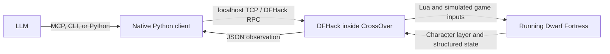

# DF-LLM: live adventure-mode harness

A working prototype for controlling the Windows Steam version of Dwarf Fortress
with DFHack from macOS/CrossOver. Python connects directly to DFHack over localhost;
there is no Wine subprocess per action and no screenshot/OCR dependency.

Tested on this Mac on 2026-09-07 with **DF 53.16 / DFHack 53.16-r1.1**, in the
CrossOver bottle `Steam`. The game is configured for **127.0.0.1:5001** because
macOS Control Center occupies port 5000.

## Use it now

Run these from this folder. Python 3 is the only host dependency.

```sh
./dfctl doctor
./dfctl settings --mode complete --acknowledge --view concise
./dfctl look --text
./dfctl brief
./dfctl status --text     # comprehensive, including every character section
./dfctl unit 7896         # visible character inspection, no custom Lua
./dfctl items --radius 20
./dfctl item 14438
./dfctl pickup 14434 --text
./dfctl stow 14434 495 --text
./dfctl walk-to 70 68 128 --text
```

Item IDs and coordinates above are examples from this adventure; inspect the
current state before choosing targets. The controller chooses what to do and
when to interrupt. The harness executes the intervening game inputs and checks
the requested result.

`settings` saves controller preferences in `.df-llm/controller.json`, shared by
CLI, Python, and MCP. It does not send game input. Use `--settings PATH` or
`DFLLM_SETTINGS` for a separate controller profile. Settings are reread on each
call, including by an already-running MCP server. Precedence is built-in,
saved, client/CLI constructor overrides, then per-dispatch overrides. The
built-in step/acknowledgement defaults are unchanged; the example above is an
explicit controller choice. `settings --reset` restores the built-ins.
Routine observations default to the concise projection; an existing saved
`observation_view` preference takes precedence. Full observations and comprehensive
character status remain explicit queries.

`settings --set '{"dispatch_timeout":45,"result_format":"compact"}'` saves
additional preferences. `settings --interrupt-on '{"blood_loss":true}'` saves
controller interruption conditions; per-dispatch `interrupt_on` replaces that
whole predicate object. Partial execution updates preserve other settings.
MCP `df_settings` and `Client.settings(update=...)` use the same file.

Prefer the short CLI/MCP operations in routine play. `look` is
`observe --view concise`: ASCII terrain, visible units, current choices, held
items, inventory count, burden, and the latest four relevant reports, with
explicit omission metadata. It skips the full native inventory reader.
Terrain landmarks use exact inclusive `[y, x_first, x_last]` spans grouped by
z-level, shape and material. `brief` retains equipment, needs and skill XP;
`status` retains the comprehensive character contract. Decoded
menus return native choices; unclassified interface states retain UI text.
`observe --view choices` reads only the current menu or prompt, without the
inventory, terrain or report history. The same view is available through Python
and the normal MCP toolset.
`observe --view full` retains detailed items and all 80 observed reports.
Internal dispatch execution reconstructs the full observation from versioned
transport deltas, independently of the controller's reading preference. It
collects reports after its last cursor instead of relying on the UI report tail.
Decoded interfaces omit the ASCII UI buffer during ordinary execution; full UI
diagnostics and raw UI inputs capture it. Unknown interfaces automatically retain
their ASCII guard. Omitted buffers are marked and never represented as empty UI.

`./dfctl actions` is the compact controller reference. `./dfctl actions strike`
returns one action's exact schema and result semantics without contacting the
game. Python `Client.actions(name)` and MCP `df_actions(name)` use the same
schemas as the dispatch tool. Obtain target/body-part IDs with `unit` and weapon
attack indices with `item`; routine play should not require source-code reads.

`brief` / `df_brief` / `Client.brief()` is a separate character projection for
health, attributes, skills, equipment, load/burden, movement and needs. It labels
omissions and retains unknown/truncated coverage. Its native reader skips omitted
profiles and descendant item descriptions; shared readers still validate all
bounded weight caches. `query_coverage` describes the selected fields only.
`status`, its aliases, and their text output continue returning the comprehensive
report. In a live comparison, the internal brief reply fell from 322 KB to
18.5 KB, with the same displayed character facts (7.7 KB controller JSON).
These are measured payload sizes, not guaranteed limits or latency claims.
Brief omits duplicate native counters, consumption history and calculation
provenance; status retains them.

Actions return **controller receipts** by default (`format: compact`, schema 2).
Compact schema 2 was introduced in 0.11.0. Version 0.12.0 reduces internal
traffic and adds action/environment coverage; the receipt contract is unchanged.
Full diagnostic records retain their `dispatch` structure.
Read `values` and `said`, then `outcome`, field-level `changes`, and a concrete `blocker` when
unfinished. The small readiness snapshot contains position, movement/input
readiness and open panels. `dispatch_id` names the saved diagnostic record;
`state_id` guards the next action; `from_state` identifies the pre-dispatch
baseline for changes. One `inputs` count measures game inputs. `ticks` is elapsed
local simulation frames when that delta is known, not world-calendar time.
Travel receipts also expose `calendar_ticks`, or an explicit calendar boundary
when the year changes. A local map reload can reset its frame counter.
Unchanged data and successful-stage boilerplate are absent. JSON is the default;
`--text` renders the same facts as readable lines.

Dialogue replies occur once in `said: [{unit, topic, reply}]`. Choices appear
once when needed, grouped by native type. Verified historical-figure subjects
use `{hf, name}`: dispatch `talk UNIT --topic AskAboutHf --subject-hf-id HF`.
Other choices have short guarded IDs, accepted by `--choice-id`, `select-option`
and `select-interaction`. Internally they resolve to the full native identity;
changed option sets and expired handles are rejected. Labels are not replaced
by guessed historical-figure IDs when native verification fails.

The default `event_detail: task` counts routine item reports, ambient conversation
and simple animal actions in `omitted.events`; replies, unknown report types,
combat reports and reports named in interruption conditions remain visible.
Use `--event-detail all` per action or `settings --set '{"event_detail":"all"}'`
to include the other reports. Handled prompts are counts by kind; an unresolved
prompt retains its text and choices. Ordinary need-timer increments are represented
by ticks; severity changes, drinking effects and unknown readings remain explicit.

Acknowledgements cover both native adventure announcements and the separate
world popup queue, including night-attack messages. A popup blocks ordinary
input even when the adventure announcement flag is false. Its text and count
remain visible until the controller delegates acknowledgement; the executor
uses the verified key for that native message type.

Read omitted information without executing anything:
`dispatch-details ID --section events` (also `prompts`, `steps`, `summary`,
`compact`, or `full`), `Client.dispatch_details(id, section)`, or
`df_dispatch_details`. The native session retains 128 dispatches; expired records
are explicit. Use `--log PATH` for a lasting JSONL trace. `--result-format full`
on CLI/Python or development MCP retains the complete diagnostic action response.
Duplicate requests return the original receipt; use the details query to inspect
it instead of reconstructing the request.

The generic controls remain available. `move` takes one step;
`wait` sends `A_SHORT_WAIT`, one short game wait.
`wait-ready` waits for the game to finish an existing turn **without** taking a
game action. Every action returns an `outcome` after completion, a
controller decision, interruption, or an execution limit.

For menus and details:

```sh
./dfctl keys A_INV
./dfctl choose 'a unique visible label' --text
./dfctl click 98 15 --text
./dfctl inspect 75 73 128
./dfctl text 'some text'
./dfctl dismiss --text     # one detected help / More / Okay page
./dfctl key A_TALK --text
./dfctl select-unit 4232 --text  # only inside the conversation creature picker
./dfctl act '{"type":"move","direction":"nw"}'
./dfctl --log .df-llm/episode.jsonl observe
```

The coordinates above are examples from the first live test. Always use a fresh
observation for current coordinates and labels. Labels must match exactly one
place in the character layer. If a label appears twice (including repeated rows
for a tall tab), use `click X Y` for the intended occurrence.

## Comprehensive character status

Use `./dfctl status`, MCP `df_status` with `{}`, or `Client.status()` for the
current adventurer's comprehensive character report. `character-status`,
`df_character_status`, and `Client.character_status()` return the same report.
JSON is the default; `--text` adds a reading summary and preserves every
character section, including complete anatomy and item definitions.

**Compatibility change in MCP 0.5.0 / character schema 2:** `status` now returns
the character report with game/input state nested under `status`. For the old
lightweight readiness response, use `./dfctl game-status`, `df_game_status`, or
`Client.game_status()`. Routine observations and dispatch responses stay compact.

The character sheet contains:

| Section | Contents |
|---|---|
| Identity and affiliation | Name, age, sex/orientation, race/caste, professions, historical figure ID, civilization, groups, occupations, site links, squad, kill count |
| Health | Blood, pain, exhaustion, hunger/thirst/sleep counters, stun, unconsciousness, suffocation, fever, paralysis, vision/breathing and other explicit condition flags |
| Body | Named body-part IDs, active damage/treatment flags, functional limbs, raw size, wounds, syndromes and effect targets, all tissue layers, temperatures, and healing state |
| Attributes and skills | Stored/effective physical and mental attributes, attribute maxima, native skill records, ratings, effective levels, XP thresholds, and rust |
| Needs and personality | Physiological counters and exemptions, psychological needs, focus, stress, traits, values, goals, emotions, memories, preferences, habits, mannerisms and temporary changes |
| Equipment and movement | Full inventory and nested contents with body-part names, selected/current gaits and raw parameters, following target and native action types |
| Encumbrance | Total carried kilograms, weight by native inventory mode, ten heaviest carried items, cache validity, and displayed HUD speed when readable; unsupported capacity and load penalty are explicit |
| Conditions and appearance | All unit flag groups, mood, pregnancy/ghost state, curse and transformation modifiers, appearance modifiers/genes/colors/styles and their definitions |
| Relationships and companions | Named historical and unit links, social records and attitudes, recent conversation partners, companion and party membership |
| Knowledge and performance | Known books and performance forms, secrets, creature knowledge, rumors and witness reports, scholarly/religious knowledge, performance skills |
| Abilities and combat | Body and granted interactions, item powers and cooldowns, natural attacks, opponent/last hit, attack awareness, wrestling and kill records |
| Possessions, career and reputation | Item values, carried currency, debts/accounts, owned/traded items, familiarity, assigned buildings, career and reputation profiles |
| Obligations and activity | Journal agreements with typed details, religious objective, requests/commands, sleep permissions, current job, social activity, tagged action payloads, waiting/sleep and travel state |
| Senses and history | Valid detection slots, vision/smell state, character report logs and historical profiles, including artistic works and whereabouts |
| Coverage and native sheet | Availability and truncation by section; native description/thought/health prose when already populated for this character's open unit sheet |

The response has `format: "character_status"`, `schema_version: 2`, `available`,
the usual `state_id` / `effect_id`, current game/input `status`, and `character`.
When there is no active adventurer, it returns `available: false` with a reason.
`character.unavailable` identifies unreadable or unsupported fields, and
`character.truncated` records list limits. Missing data is distinct from zero,
false, or an empty list. Optional native profiles use `{present: false}` when
absent; an unreadable parent profile is unavailable instead. Equipment retains
its existing truncation flags and includes them in the report's coverage.

`character.coverage.sections` contains 29 sections, each marked `available`,
`partial`, or `unavailable`, with missing/truncated counts. Check this alongside
`unavailable` and `truncated` before assuming a field is known. `coverage.complete`
means no missing or truncated fields in the supported report, not that DFHack
exposes every internal game variable. Character-owned profiles are expanded;
world references use IDs instead of recursively copying other units or the world.
Native numeric enum fields have `enum_labels`; other raw numbers retain native
semantics. Historical profiles are kept under `history` and can differ from the
currently loaded unit. Their absence does not imply a healthy or empty character.

This is a read-only snapshot under DFHack's core suspension: it sends no game
input, opens no menu, and does not wait for a turn or dismiss prompts. Controller
dispatch/acknowledgement defaults do not turn it into an action. The detailed
reader is loaded only for this query, leaving routine observations compact.

Health and need counters retain native values; the harness does not invent
severity or urgency thresholds. Stored and effective attributes/skills are
separate. Body dimensions, wound counters and gait parameters retain native
units. Item masses also have a kilogram conversion as described below.
`health.recuperation_healing_rate` is the unit's native `effective_rate` field;
this field was previously misplaced under movement and is a healing rate.

Limits are 512 anatomical parts, 200 wounds with 512 parts per wound, 100
syndromes with 200 symptoms each, 300 skill records, 100 psychological needs,
values or goals, the last 100 native emotion records, and 100 native action
records. Additional profiles are bounded to 4096 entries per vector, 50,000
profile nodes, depth 10, and 16,000 bytes per string. The character inventory
allows 4096 total items and container depth 16; normal observations retain their
smaller limits. These are technical output bounds, with explicit truncation
metadata. The full report can be large; use `game-status` or `observe` for the
regular control loop and `status` for a complete character assessment.

Known current-build gaps are explicit: the native attack/dodge/charge-defense
preference globals. Appearance prose is unavailable
unless the matching unit sheet is already populated; structured appearance is
always attempted. The query does not open menus to manufacture these values or
substitute old formulas. Additional unsupported native variants also appear in
`unavailable`; untagged unions are never read. Quest/rumor/action payloads use
verified native type tags.

### Encumbrance, calculated movement, and physical needs

`character.encumbrance` is included in the same read-only status query:

| Field | Meaning |
|---|---|
| `total_weight_kg` | Total carried mass from native caches; present only when all root and descendant caches pass validation and `weight_complete` is true |
| `known_weight_kg` | Subtotal of roots whose own and descendant caches are valid, even when the full load is unknown |
| `native_cached_weight_kg` | Aggregate of valid root caches, before skill discounts; may be stale while contained-item caches are invalid |
| `by_mode` | Weight and item counts by native inventory role, with completeness for each group; `Worn` includes backpacks, and `Weapon` can include held clothing |
| `heaviest_items` | Up to ten carried root items, descending by kilograms, with IDs and descriptions; each container's weight includes its contents |
| `unweighed_items` | Roots whose mass cannot be confirmed, including invalid/unreadable contained-item caches, with reasons |
| `capacity` | Native no-penalty capacity in kilograms, effective strength and body-size inputs, and calculation provenance; this is not a hard inventory limit |
| `burden` | `Unburdened`, `Burdened` or `Overburdened`, with percentage and thresholds, calculated by the DFHack Lua helper from unit/item state; independent of panels |
| `load_penalty` | Skill-adjusted load, capacity used, excess kilograms, added movement cost, and speed reduction relative to the same state without load |

Mass is `weight_raw.whole + weight_raw.fraction / 1000000` kilograms, as defined
by [DF's mass structure](https://github.com/DFHack/df-structures/blob/master/df.d_basics.xml).
Valid native container weights already include their contents, and stack weights
already include the stack quantity. The sum counts each carried root ID once;
adding nested weights or multiplying by stack size would count them again.
The total has no armor-skill discount. Native cache validity is not a guarantee
that DF has refreshed every aggregate: live filling/heating left the backpack
cache marked valid while the waterskin and water caches were invalid. The
reader now rejects a total when any descendant is invalid, the parent weighs
less than its contents, or the containment scan is incomplete. It retains the
native root-cache aggregate separately. The burden helper uses those root caches
with DFHack's effective armor skill; `load_penalty.physical_weight_complete`
marks whether the independent physical-mass validation passed.

Full item observations include `weight_computed`. Compact item changes use
`weight_kg`, with null for an invalid native weight cache; unchanged fields are omitted.
Character inventory entries additionally include `weight_kg` only for valid
caches, or `weight_unavailable_reason` otherwise. An invalid cached value is
not zero. The reader does not call `calculateWeight` or mutate caches. The
aggregate reads native inventory independently of the detailed inventory's
output limits: at most 4096 root entries and 4096 contained-graph nodes, depth 16,
with at most 100 unweighed-item details. Repeated contained references and cycles
are not treated as verified mass.
If a bound is reached, truncation is explicit; an incomplete scan does
not produce a total.

`character.movement.displayed_speed` returns the current gait and numeric speed
from the game's ASCII character layer, e.g. `{gait: "Walk", value: 0.471,
text: "0.471", units: "native_display", source: "ui_character_layer"}`. The
reader requires the normal input-ready adventure view and an aligned gait/speed
pair at the bottom of the HUD, with a recognized native gait. Hidden or
unrecognized text produces an unavailable field; it never opens a menu or
uses a screenshot. This is the rounded displayed speed, not a capacity
percentage or a measurement of the penalty caused by weight alone.

`character.movement.effective_speed` is calculated from native state, independently
of the HUD or any open modal. It includes the current gait, buildup, native movement
cost/delay, unrounded rate, HUD-formatted value, the rate at full gait buildup,
and an unloaded comparison. Rates use the game's HUD units, not wall-clock
tiles/second; they do not guarantee movement is possible. The component list
explains contributions from load, health, needs, gait attributes, terrain, and
other supported modifiers.

`character.physiology.interpreted_needs` gives `hunger`, `thirst`, and `sleep`
warning labels, numbered native stages, raw counters, and the next stage's
threshold and remaining counter units. Creature exemptions are explicit; below
the first threshold the label is `No warning`. Blood thirst is included when
applicable. These are the game's warning stages, not controller threat decisions
or predicted wall-clock deadlines. Repeated labels retain distinct stage numbers.

The movement and need calculations are verified for the installed DF 53.16 Windows Steam
executable and gated by its version, OS, and PE timestamp. The implementation
reconstructs current native calculations in pure Lua; it does not call DFHack's
disabled `computeMovementSpeed` helper or reuse the obsolete encumbrance formula.
Other builds, mounted movement, unverified vision adjustments, missing/stale
inputs, arithmetic overflow, and bounded inventory scans return explicit
unavailability. See [calculation provenance, formulas, and limits](docs/character-calculations.md).

Capacity, load penalty and burden come from the repository's read-only DFHack
Lua extension, `dfharness/burden`. It uses `getPhysicalAttrValue`,
`getEffectiveSkill`, `item:isArmor()` and mapped body/inventory fields. One
bounded pass over root inventory caches supplies status, brief and item receipts;
containers already include their contents. Burden remains readable with panels
or modals open. It has no screen scan, PE-timestamp gate or movement-speed port
dependency. The screen-buffer comparison lives only in the development tests.

DFHack scripts can use the same helper directly:

```lua
local load = dfhack.reqscript('dfharness/burden').getBurden(dfhack.world.getAdventurer())
-- load.capacity, load.load_penalty, load.burden
```

The source is `dfhack_lua_unit_burden`; this extension performs the calculation
inside DFHack using its APIs and native caches. Missing inputs, invalid caches,
duplicate roots, inventories over 4096 entries, arithmetic overflow, mounted
units and hidden-curse variants return explicit unavailability. The known
effective-skill ambiguity at sleep counters 846000–863999 is also unavailable
when it could change an armor discount. Status never refreshes caches to fill a
missing value. There is one burden calculation; `estimated_burden` is removed.

## Composable gameplay objectives

`drop` and `stow` automatically remove the specified item when it is worn.
That prerequisite shares the original dispatch's budget, interruption predicates
and resume checkpoint. It never chooses other equipment to discard. If the native
menu offers no matching operation, the blocker identifies the item, role and
menu context; it does not guess at fit or hand-capacity rules.

Item receipts return `values` with the resulting location, cached carried load
and burden from unit state. For containers, `contents.intact` compares item identities,
parent containers and stack quantities with the initial observation; missing or
truncated readings produce null. Contents IDs are bounded to 64 in the value.
`changes.inventory.containers_removed` groups each departing container with the
contents still observed inside it; standalone removals remain in `removed`.
Strike values include the target's life state, posture, consciousness, blood,
wound count, pain and exhaustion. Missing fields remain explicit. The target
reading accompanies the existing execution snapshot, without a full unit query.
For a sequence, `assessment.load` reports current load once; individual item
values omit repeated load blocks. Repeated strikes retain each attempt's effect
and only the latest sampled condition for each target, attached to its stage.
Intermediate load and target samples remain in the full stage diagnostics.

`sequence` runs an ordered list of semantic actions as **one dispatch**. Each
stage must reach its verified completion condition before the next begins.
The controller supplies the targets, constraints and completion policy; the
harness approaches targets, operates native menus, handles delegated prompts
and checks the result. Stages share one input budget, timeout, interruption
policy and event history. They never create nested dispatch leases.

```sh
# Explicit equipment choices, followed by a posture goal, in one dispatch.
./dfctl sequence '[{"type":"equip","item_id":14427,"replace":[14426],"disposition":"stow","container_id":14382},{"type":"set_posture","posture":"standing"}]' --mode complete --acknowledge

# Explicit people and topics; approach each person, collect their reply, close UI.
./dfctl converse 10657 10660 --topic AskAboutCurrentState --mode complete --acknowledge
```

The same actions work with `Client.act` and MCP `df_act`:

```json
{
  "action": {
    "type": "converse",
    "unit_ids": [10657, 10660],
    "topics": ["AskAboutCurrentState"]
  },
  "execution": {
    "mode": "complete",
    "acknowledge": true,
    "max_steps": 64,
    "interrupt_on": {"blood_loss": true, "new_wounds": true}
  }
}
```

`converse` is a reusable objective built on `sequence`: close the current
conversation interface, visit the supplied people in order, ask each supplied
topic in order, verify each target's next utterance after ours, collect its
reports, and finish with the interface closed. It chooses no people, topics,
greetings, follow-up questions, or tactics. For a new acquaintance, explicitly
include `Greet` first if the native menu requires it. A topic must match an
available native type or full label uniquely; an ambiguous or absent topic
returns its choices. Closing the interface does not terminate a social activity
or suppress ambient speech.

`talk --tact Persuade` (or `Intimidate`) delegates the native tact for a topic
that requires it. The harness verifies that the tact picker belongs to the
requested topic and listener, selects the native choice, then continues the
same utterance/reply verification. An omitted tact returns one structured
choice list; an inapplicable tact is not silently ignored. A fresh `talk`
request can continue an already-open tact picker by its exact native topic.
The verified interrogation submenu is opened automatically for its requested
questions. Unrelated topics are never substituted. While waiting, receipts
include the listener's native unconsciousness counter when available, and keep
attributed response reports visible even before a spoken reply is verified.
This does not change completion policy or cause automatic wake-up actions.
For per-topic arguments, `converse.topics` also accepts objects such as
`{"topic":"FishForPlots","tact":"Persuade"}` or
`{"topic":"AskAboutHf","subject_hf_id":123}`. CLI `--topic-spec` accepts these
JSON objects and may be mixed with `--topic` in request order.

Compact composed receipts report `completed_stages`, collected `said` replies,
and the unresolved stage/action in `blocker`. Full diagnostics retain every
stage's verification record, event and prompt. Use the returned `resume` after
a limit or interruption: completed stages are retained, and a sent topic is
never selected again. Earlier verified results do not claim that a later stage
left those postconditions unchanged. The sequence stops at the first unresolved
stage; it does not skip failures or invent a fallback.

Receipts also include changed skill XP and stored attributes under
`changes.progress`. For example, `"HAMMER":{"xp":10,"progress":[112,600]}`
means ten XP gained during this dispatch, with 112 of the 600 XP needed for the
next rank. A rank change adds `level`. XP deltas use DFHack's native total
experience, so crossing a rank does not look like losing XP. Resumes compare
their own interval and do not count gains already returned. Unchanged skills
and attributes are omitted; missing, truncated or changed-character samples
are reported as unavailable. This narrow reader shares the character sheet's
skill and attribute accessors, skips inventory/history/UI, and adds no RPCs.

Limits are explicit: 1–64 semantic actions per sequence, at most 128 expanded
stages; `converse` accepts 1–32 distinct unit IDs and 1–16 topics, within that
expanded limit. A sequence may contain `converse`, but nested sequences and raw
input stages are unsupported. The shared native-input budget defaults to 32;
the controller can request 1–1,024 inputs per dispatch/resume. Larger budgets
keep all interruption checks and the wall-time limit, and return resumable
progress if either limit is reached. All existing action limits apply, including visible local
routes and unsupported combat choices. Local coordinates and excluded tiles in
a sequence refer to its initial map origin, including stages that have not
started yet. They stay on those world tiles across native map rebases. If the
initial or current coordinate frame is unavailable, the harness returns
`coordinate_frame_changed`. Use a fresh observation for targets chosen after
travel to a different area.

## Item and movement dispatches

`items` / `df_items` reads visible nearby ground items and nested container
contents in one query. `item` / `df_item` inspects one carried or visible ground
item. Both expose IDs, material, quality, wear, stack size, raw mass and volume,
container location, armor coverage/layer data, and weapon definitions where
applicable. Inventory observations expose the same item details.

| Action | Verified result |
|---|---|
| `pickup(item_id)` | The specified item is carried; approach its ground tile and navigate the pickup menu as needed |
| `equip(item_id)` | The item has native inventory role `Worn` |
| `wield(item_id)` | The item is held with native inventory role `Weapon` |
| `remove(item_id)` | The worn or contained item is held |
| `drop(item_id)` | The item is loose on visible ground |
| `empty_container(container_id)` | The specified carried container is empty; requires a verified native liquid-child emptying option when contents exist |
| `stow(item_id, container_id)` | The item is inside the specified carried container |
| `drink(item_id or container_id, portions=1)` | Each specified carried liquid portion is consumed, with a native drink report and verified thirst effect |
| `drink_from(x, y, z, material, portions=1)` | Each specified drink from a native environmental liquid source has a drinking report and verified thirst effect |
| `eat(item_id, portions=1)` | Each specified solid food portion is consumed, with a native eating report and verified hunger effect |
| `walk_to(x, y, z, arrival_radius=0)` | The adventurer reached the requested tile or explicit radius on its z-level |
| `set_posture(posture)` | Native `on_ground` matches `standing` or `prone`; a blocked stand-up is reported |
| `set_sneaking(enabled)` | Native sneaking flag matches the explicit boolean |
| `set_gait(gait)` | Native selected gait matches the exact name in the current locomotion mode |
| `travel_to(x, y, arrival_radius=0)` | Surface travel position is within the requested radius; travel mode stays open |
| `end_travel()` | Travel is closed and the local adventurer is loaded |
| `rest(hours)` / `sleep(hours)` or `until="dawn"` | Native wait-awake/sleep settings and elapsed calendar duration; 1–24 hours or next local dawn with verified sky/clock data |
| `save_game(name, overwrite=false)` | Native saving finishes and the named `world.sav` is newly written; existing folders require explicit overwrite |
| `make_campfire(x, y, z)` | Native tile material confirms a campfire at the specified tile |
| `thaw(container_id, x, y, z)` | Water in the specified carried container becomes liquid at the specified heat source, preserving its portion count |
| `fill_container(container_id, x, y, z, material, source_state=...)` | The specified carried container reaches native capacity with the requested material from that tile |
| `talk(unit_id, topic=... or choice_id=...)` | Approach and open the specified conversation; a supplied topic defaults to verifying the target's next reply; `completion="utterance"` verifies only our speech |
| `end_conversation()` | The conversation interface is closed |
| `use_stairs(x, y, z, direction)` | Approach these observed stairs, then verify arrival exactly one level up or down |
| `combat(unit_id, option_id=...)` | Approach and open the requested combat target; optionally select an offered native move; subsequent decisions and unverified effects return `needs_input` |
| `strike(unit_id, body_part_id, item_id, attack_index, style)` | Execute one explicitly aimed melee attempt and verify its native strike/recovery phases; return attributed wounds, range failure, or unverified damage |

`save-game NAME` writes a checkpoint through the game's Save and continue flow.
Names accept 1–40 letters, digits, spaces, underscores and hyphens, starting
with a letter or digit. Native working and autosave folders are reserved.
`--overwrite` delegates replacement of an existing named save. The default
returns `save_exists` before input. The workflow opens Options, selects the
native save operation, edits/verifies the filename, handles a delegated
overwrite and waits for file evidence. Resume retains its submission state.
For a longer save, supply `--seconds 120`. The dispatch's remaining time also
bounds synchronous RPC waits, so a native save can finish without a second
transport-timeout setting. Ordinary queries retain `--timeout`; final
observation/checkpoint bookkeeping after an execution deadline uses that
bounded RPC allowance. Transport failures remain uncertain and are never
retried automatically. Completed receipts include the verified name and file
timestamp in `values`. No save is claimed merely because a menu closed.

The initial Options buttons are mouse-only in the verified native handler.
This adapter computes their interior coordinates from native option/text counts
and current window dimensions, without matching ASCII labels. Filename entry
uses verified native text/Select keys; its blinking UI cursor is not a state
dependency. Layout selection is build-scoped. File verification uses DF's
configured data root, including CrossOver's per-user save directory. A filename
edit is one mechanical input batch; full diagnostics record its native key count.
Save-and-quit and timeline selection remain separate, unsupported objectives.

`unit` / `df_unit` / `Client.unit(id)` inspects a visible character's health,
physical attributes, stored/effective skills, equipment, anatomy, affiliations,
and native opponent reference. It does not infer hostility or predict victory.
The concise default omits unflagged anatomy and detailed item definitions;
`unit ID --view full` returns the complete supported unit inspection. This is a
bounded native-state view, not a promise of every NPC's hidden history or mind.
Unloaded or invisible units return `available: false`; absent optional records,
failed reads, and truncation are distinct.

`drink ID --portions N --mode complete` consumes 1–32 explicitly requested
portions from that carried liquid. `drink CONTAINER_ID --from-container` resolves
fully observed liquid contents and pins their IDs for execution/resume. Multiple
stacks can supply portions when their native material, type, quality, wear and
coatings are known and equal. Replaced IDs are never adopted implicitly.
Different, unreadable or frozen contents return a blocker. Each portion requires
a reduced source stack, a native `DRINK_ITEM` report and a verified thirst effect;
a reset followed by passive ticks is valid. Sending a menu selection alone
cannot complete it. Progress survives a limit/interruption and works inside
`sequence`. The controller chooses the quantity and interruption policy.
Frozen contents return `source_not_liquid`. `thaw CONTAINER_ID X Y Z` approaches
the specified heat source and selects the native heating option. Further heating
requires observed temperature or melting progress; unchanged readings stop it.
Thawing may create a new liquid item ID. The container form of `drink` avoids a
separate ID lookup. `eat ID --portions N` uses the same completion policy for food.
The controller chooses sources, containers, quantities and interruption policy.
`drink-from X Y Z MATERIAL --portions N` approaches the specified source tile,
opens the native consumption menu and selects only that material in `Liquid`
state. `MATERIAL` is an exact token such as `WATER`. This supports native terrain
sources; wells and ground containers are separate, unsupported source classes.
Each portion requires a new `DRINK_ITEM` report and verified thirst effect.
Native refusal, ambiguous or incomplete source data and unchanged effects stop
without replaying consumption. Interrupted portions retain their checkpoint.
Fullness warnings remain visible even when drinking succeeds: DF also puts
those warnings in its `CONSUME_FAILURE` report category. The verified effect,
not that category's name or rendered wording, determines completion.
Frozen alternatives appear once with their native phase; “Eat snow” is not
silently substituted for drinking. Native ingestion's `getIngestedItem()` method
allocates a game item, so observations read tagged source fields instead.

Known native source entries with the same material token, phase and coordinates
are equivalent execution choices. For example, melted snow and ice can produce
two WATER entries with different unused material indices. The harness selects
one guarded native entry; incomplete or different source classes still require
a choice. Live direct drinking from spilled water is verified. Frozen river
surfaces and snow correctly remain unavailable as liquid sources.

`empty-container CONTAINER_ID` explicitly empties the whole carried vessel.
DF's Drop action on a contained liquid performs that broader operation, so
`drop LIQUID_ITEM_ID` now stops before selecting it. Emptying pins the observed
contents, selects one verified native emptying option and requires empty
contents plus an `EMPTY_CONTAINER` report. An already-empty vessel takes no
input. A successfully read empty container explicitly returns `contents: []`.
The adapter requires a liquid child when contents exist; it does not
drop solid contents one at a time as a substitute. The vessel remains carried,
while liquids may become ground spatters instead of loose items.

`fill-container CONTAINER_ID X Y Z MATERIAL --source-state STATE` fills the
specified carried container from that tile to its native capacity. `MATERIAL`
is a native token such as `WATER`; the optional phase selects between native
sources such as `Solid` and `Liquid`. Existing contents must be fully observed
and of that material. Capacity and summed content volumes verify fullness;
additional selections require volume progress. Freezing or melting can change
item IDs without invalidating the material goal. A filled container is not
necessarily drinkable: thaw frozen water separately. None of these operations
require screenshots.

`rest HOURS` waits awake; `sleep HOURS` delegates sleeping as necessary for the
explicit duration. Both configure the native panel, execute under the shared
policy, and verify calendar progress after local-map unloading and reloading.
Party sleeping/waiting flags keep execution pending during offloaded processing.
An early stop returns the elapsed duration and a resumable checkpoint; it never
silently starts another rest. Sleep can leave the character prone, so standing
up remains an explicit controller action. A native `CANNOT_REST` refusal returns
`rest_restricted` with its message and remains blocked on resume without retry.
Calendar progress is reported separately from local ticks; local frame counters
are not compared across map reloads.

`rest --until-dawn` / `sleep --until-dawn` is exclusive with `HOURS`. It selects
the native dawn control and pins the elapsed time to the next local dawn using
the verified 53.16 main-adventure clock and longitude. `status` includes this
calculation under `activity.next_dawn`. Unknown clock data, arena mode or no
visible sky are explicit blockers; changing longitude does not retarget a
submitted rest. A start exactly at dawn means the following day's dawn. The
clock and completion logic have native-code and fixture verification. Native
sleep/dawn configuration and cancellation were also verified live without time
advancement; successful live until-dawn completion remains unverified. Hour-based sleep tests encountered
native night attacks, so no uninterrupted overnight success is claimed.

Talk and combat approaches use the same local route constraints as `walk_to`:
`allow_occupied`, `max_liquid_depth`, `blocked_tiles`, and `extend_route`. They approach within
one tile on the current z-level, using the observed map crop. Stairs require the
controller to specify the source tile and direction; the harness does not choose
which stair to take. Stair arrival verification accounts for local map rebasing.
Route observations resize/recenter to include the character and chosen target,
within a 101 × 61 tile bound. Unseen terrain, excluded routes and unsupported
z-level changes still return a blocker. Standalone walking keeps its destination
and excluded tiles anchored across local map rebases. All loaded visible units
are returned, including outside the ASCII crop or its z-level; `in_map` says
whether a creature is plotted. Visibility interruption rules use that full list
and stop if its 500-unit enumeration is truncated.

`strike` owns the mechanics of one requested melee attempt: approach, target,
aim, style, submission and recovery. Supply the target's native `body_part_id`,
the weapon's `item_id` and `attack_index`, and `style=normal|quick|heavy|wild|precise`.
`item` exposes weapon attack indices; `unit --view full` exposes target anatomy.
For a natural attack, use `item_id=-1` and its native body-plan attack index from
`status` or the active combat choices. A single strike clears residual charge
and multiattack flags, verifies each style toggle, and reopens an incompatible
known aiming menu as necessary. It does not choose another weapon, limb or target.

```sh
./dfctl strike 8182 --body-part-id 3 --item-id 485 --attack-index 0 \
  --style quick --mode complete --acknowledge
```

The native input receipt captures the exact queued attack ID before simulation
continues. A bounded read-only observer verifies its preparation and recovery
countdowns; it holds no native pointers and stops on world replacement or
receipt eviction. An attack that disappears before verification returns a
concrete blocker and is not repeated on resume. The observer is limited to
8192 simulation ticks and 256 queued native actions. Existing pending attacks
are returned to the controller instead of being mistaken for the new request.
Comprehensive `status.activity.actions` also retains the native action payloads.

Compact receipts put useful outcomes in `values` before the event log. A strike
value reports `resolution=wounded` with newly attributed wound IDs,
`out_of_range` from the native adventurer-only report, or `processed` with
`damage=unverified`. Finishing an attempt does not promise injury or victory.
Damage inspection is bounded to 1024 target wounds and 512 new reports;
unavailable evidence stays explicit. Sequence values include their stage index
and are returned once across resumes. Full timing/selection evidence remains
in `dispatch-details`; completed-stage bookkeeping is omitted from compact output.

`combat` remains a menu-only objective. Its completed result means the requested
target menu is open. Defense, wrestling, charge, multiattack and ranged completion
remain unsupported. Readers inspect only fields owned by the active native mode;
unknown modes retain ASCII text and an explicit limitation.

`navigation` / `df_navigation` returns current travel coordinates, the native
site travel grid, and character-known group/beast rumors sorted by distance.
Rumors identify leads, not verified present enemies. The controller chooses the
destination and assesses the inhabitants. `travel_to` follows the shortest
available route through the current native site grid, then direct overland
waypoints. It returns at blocked movement, a native restriction, or a forced
exit from travel. `end-travel` returns to local mode and verifies map loading;
it does not promise an exact local arrival tile chosen by the game.
Travel tiles are 16 local tiles; three travel tiles make one embark tile.
Overland input can advance three travel tiles asynchronously while the native
phase still says `TAKING_INPUT`. Its receipt waits for 250 ms of unchanged native
travel/processing state, with a 30-second settlement ceiling. This is a quiet
window heuristic, followed by coordinate verification, not a native guarantee
that arbitrary future animation has ended. No input is repeated while waiting.
`arrival_radius` is measured with Chebyshev distance and can range from 0 to 48.
The native site map includes direction masks and forbidden-travel flags;
overland terrain does not yet have a full route planner.

These actions use the same step/complete, acknowledgement, interruption and
resume policies as inventory actions. Posture is also returned as `on_ground`
in ordinary observations. Map `landmarks` retain stairs/ramps underneath unit
glyphs and campfire material. Structured map features include visible buildings,
door flags, wells and connected water/magma/ice/brook regions with nearest tiles.
A well's presence is not proof of usable water. `game-status` retains player identity, world time and party need counters
when fast travel offloads the local map; the full character reader requires a
loaded adventurer.

`equip` and `wield` accept `replace: [ITEM_IDS]` and
`disposition: "hold" | "drop" | "stow"`. Stowing also requires `container_id`.
The workflow acquires the target, removes only the named replacements, equips
the target, then applies the requested disposition **after verifying the new
equipment**. `hold` is the default. The harness does not select better gear or
infer which existing items should be removed. An optional `body_part_id` adds
an exact postcondition; if the game chooses another body part, the result
returns for controller input rather than claiming success.

For example, after choosing replacement IDs from an observation:

```json
{
  "action": {
    "type": "equip", "item_id": 14429, "replace": [14438],
    "disposition": "stow", "container_id": 495, "body_part_id": 15
  },
  "execution": {"mode": "complete", "acknowledge": true}
}
```

The equivalent CLI is:

```sh
./dfctl equip 14429 --replace 14438 --disposition stow \
  --container-id 495 --body-part-id 15 --mode complete --acknowledge
```

Those IDs illustrate the live replacement test.
Menu options expose native item and container IDs, labels, and
option IDs. Semantic actions scroll and select the requested ID, even when
labels are identical. `select-option OPTION_ID` / `select_option` is available
for a controller-selected option, including one requiring scrolling. The binding
is checked again inside the game before input is sent. On the installed DF
53.16 Windows build, inventory, ground, gait and ordinary conversation lists use
native OPTION keys. The shared adapter probes native scroll bounds with an empty
input pass, places the target within those bounds, rechecks its identity, and
sends the effective OPTION key within the same guarded request. Short lists can
leave an invalid stored offset untouched while interpreting keys from the start;
the probe handles that case without assuming a page height. Topic offsets use
native title-line lengths and separators, not ASCII label matching. Duplicate or
truncated rendered names therefore do not affect native selection.

One selection counts as one execution step and one game-key input; diagnostics
retain its UI adjustment. Reads never scroll. Active scroll dragging, filter
editing and undelegated quantity entry block selection. Conversation target
and tact pickers use native item indices; topics use native text-line indices.
Unimplemented combat modes and unknown builds remain explicitly limited; verified compatibility
bindings use an isolated ASCII adapter where available. A dependency symbol's
presence alone does not establish compatible behavior on a newer executable.

Local walking submits the game's `adventure_movement_pathst` command and lets
DF compute and follow its `AdventureAutomove` goal. The same executor approaches
item, conversation, combat and environmental targets. It verifies arrival from
unit position and pauses when controller-requested watch data changes; the
shared policy decides whether to interrupt or continue. One path command counts
as one input, regardless of its tile count. Incremental mode stops after the
first movement boundary; resume retains the original destination. Interruption
cancels the remaining owned goal with `dfhack.units.setPathGoal`; an already
submitted native Move may finish. No unit position, action timer or pathfinding
cache is edited. Reachability uses `canWalkBetween`; stale native caches can
produce an explicit no-connection blocker and are never forcibly refreshed.

The native command has no excluded-tile, depth or occupancy constraint fields.
Supplying `allow_occupied`, `max_liquid_depth`, `blocked_tiles` or `extend_route`
explicitly retains the existing observed-route adapter. CLI defaults omit these
fields; `--no-allow-occupied` explicitly prohibits occupied route tiles.
For this constrained adapter, `allow_occupied` defaults to false,
`max_liquid_depth` defaults to 7
(no liquid-depth exclusion), and `blocked_tiles` defaults to an empty list.
These are route constraints, not a threat classifier. A blocked destination
returns its coordinates, exclusion reasons, and occupying creatures. Walking
plans on the current z-level. The execution reader expands the initial 41×21
crop toward the destination, up to 101×61, retaining a margin around the player.
`extend_route=true` (CLI `--extend-route`) delegates advancing to observed
frontiers to reveal a route. Each planned step still uses observed walkable
tiles, known liquid depth and the same exclusions. The destination remains
fixed in world coordinates across local map rebasing. Reached frontiers and
the intermediate destination persist across interruption/resume; the search
stops explicitly if no unvisited frontier is reachable or its 4,096-position
memory limit is reached. It does not assume an unseen destination is walkable.
The controller's input/time limits and interruption conditions still apply.

For an inexact destination, `arrival_radius` / `--arrival-radius` accepts 0–48
tiles, measured horizontally on the target z-level. Zero requires the exact
tile; a positive radius permits arrival at an observed traversable neighbor.
For example, `walk-to 70 40 136 --extend-route --arrival-radius 2` reveals the
route and stops within two tiles. Unknown depth is never assumed to be dry.
The native goal can name another loaded z-level when DFHack reports a walkable
connection; the constrained adapter remains on one level. Flat-ground native
movement, radius arrival, interruption and resume have been verified live.
Pickup uses the same native walker. For a constrained pickup approach, dispatch `walk_to`
first, then perform the item action from its tile.

Travel still uses native directional moves and the existing site-grid adapter.
The old `travel_goal_*` names are not evidence of a route-goal API: the pinned
structures name them `long_action_duration` and `travel_start_*`, describing the
first move and map offloading. They are not written as a waypoint. See the
[pathing review](docs/pathing-review-2026-09-07.md) for verified interfaces and
the remaining constraints.

Material or maker species does not prove fit. `fit.wearable_now` stays `unknown`
until an observed native Wear menu establishes current eligibility; the equip
result verifies actual wearing. Mass is returned as `weight_raw.whole/fraction`
with `weight_computed` indicating cache validity; character status adds kilogram
values and the aggregate described above. A held garment also has role `Weapon`, so
use the separate item `type` and weapon definition to distinguish weapons.

## Controller-selected execution

The controller chooses execution policy for each dispatch or sets defaults once.
The same policy applies to item workflows, walking, waits, keys, clicks,
conversations, and menu actions. The harness does not classify their risk. This separation is documented
in [AGENTS.md](AGENTS.md) and implemented in [dispatch.py](dfharness/dispatch.py).

| Setting | Behavior | Default |
|---|---|---|
| `mode: "step"` | Execute one mechanical step plus delegated acknowledgements; return remaining work as `in_progress` | `step` |
| `mode: "complete"` | Execute the whole requested workflow, including Finish when a Continue/Stop/Finish prompt appears | — |
| `acknowledge: true` | Handle detected help and announcement pages, including More/Okay, and retain their text | `false` |
| `max_steps` | Limit actual game inputs, including menu navigation and automatic responses; registering/resuming a dispatch consumes no input | `32`, range 1–1,024 |
| `interrupt_on` | Stop on controller-selected facts, checked before further inputs | `{}` |

Completion and acknowledgement are independent settings. A response that has not
been delegated returns `needs_input`. Unknown detected prompts also return to the
controller. Complete mode follows the submitted action and its explicit targets.

```sh
./dfctl key A_TALK --acknowledge --text
./dfctl resume --mode complete --acknowledge --text
./dfctl resume DISPATCH_ID --mode complete --acknowledge --text
./dfctl interrupt DISPATCH_ID
./dfctl respond continue --text
./dfctl respond stop --text

# Defaults before the command; overrides after an action command.
./dfctl --acknowledge mcp
./dfctl --acknowledge key A_TALK --no-acknowledge --text
```

Use the returned `resume` to continue a saved workflow after a
step, interruption, limit, or controller decision. It identifies the previous
dispatch and creates a new dispatch ID; completed inputs are not repeated.
Always resume the latest continuation. A resume without an ID only settles the
current native action/prompts; it does not recover an item or walking recipe.
Each dispatch, including resume, uses controller defaults plus that call's
overrides. Put persistent interruption rules in controller configuration.
`observe`, `status`, `items`, and `wait-ready` remain read-only.

`interrupt_on` supports `blood_loss`, `new_wounds`, and `new_visible_units`
booleans, plus `visible_unit_ids` and exact native `report_types` lists.
`new_visible_units_except: [IDS]` excludes explicitly named units from the
new-visible-unit predicate; it does not alter visibility or other predicates.
The player reappearing after local-map loading is excluded from new encounters;
`visible_unit_ids` still uses the explicitly named IDs literally.
Health and newly visible creatures are compared with the dispatch's initial
observation. Reports already returned by a prior dispatch remain in history
but do not trigger the same interruption again after resume. These are factual
predicates: a newly visible creature is not automatically classified as hostile.

To watch named units, add `unit_health`, for example:

```json
{"unit_health":[{"unit_id":8526,"blood_loss":true,"new_wounds":true}]}
```

These opt-in rules work across semantic actions and sequences, including
processing polls. Native wound IDs detect new injuries even when the total wound
count stays unchanged. Up to 32 distinct loaded, visible units can be watched.
Missing or unreadable requested health returns `needs_input` with the unit ID,
condition and unavailable reading; it is never treated as healthy. This includes
map offloading, when a local unit cannot be inspected. Resume uses the current
controller policy and a fresh health baseline. The watch stops further harness
inputs; it cannot undo an injury or cancel an already submitted native action.
Full samples stay in diagnostic observations; compact blockers contain only the
matched condition and its evidence. No extra watch reader runs for other dispatches.

```sh
./dfctl --mode complete --acknowledge \
  --interrupt-on '{"blood_loss":true,"new_wounds":true}' mcp
```

`df_interrupt` / `interrupt` stops future harness inputs and preserves progress.
The MCP server accepts status/observation and interruption requests while
`df_act` is running; MCP cancellation also requests interruption. An input
already submitted to the game is not undone or cancelled. Stopping a native
long action still requires the controller's explicit game response. No core
lock is held while waiting for the game or controller.

Read `outcome` alongside the returned game state:

| Outcome | Meaning |
|---|---|
| `completed` | Semantic postconditions are verified; primitive inputs have settled at an input boundary |
| `in_progress` | Step mode returned with more mechanical work to perform |
| `needs_input` | A choice, unavailable item action, blocked route, or unsupported completion needs controller input |
| `interrupted` | The controller interrupted explicitly or one of its factual predicates matched |
| `no_effect` | Input produced no observable change, or a delegated response left the same prompt |
| `limit_reached` | The step budget or dispatch timeout was reached |
| `failed` | The game input handler reported an error; partial effects are possible |
| `rejected` | The supplied state guard was stale before registration; no input or checkpoint was created |

Semantic actions verify inventory roles, exact item/container IDs, or position.
A completed generic key/click does not prove an arbitrary objective such as
successfully greeting someone. Read its resulting menu and reports.
Known stale or pre-input rejections include a short reason, code and
`input_sent: false`. A stale preflight returns `rejected`, fresh state, and no
fictitious resume action. A rejection within a dispatch returns `needs_input`,
preserves the last accepted checkpoint, and releases the active lease. Its
`resume` continues from that checkpoint; there is no separate interrupt
cleanup or automatic retry. `resync_required` marks stale-state responses; use
`observe` to refresh the controller baseline before choosing a different action.

Transport/unknown execution failures remain tool errors with a dispatch ID and
recovery action: delivery may have occurred, and registration may be uncertain.
Do not treat those as known pre-input rejections or retry them blindly. Error
messages omit the native traceback; the optional JSONL log retains debug detail.

Full results include `dispatch.steps`, `dispatch.events`, `dispatch.prompts`
and stage verification records. `dispatch-details` reads those records without
acquiring an execution lease or replaying input. Resumes keep history internally
while compact replies omit messages already included in an earlier receipt.
JSONL logs record bridge requests/responses before output projection: initial
snapshots, versioned observation/checkpoint deltas, inputs and full report pages.
An ordinary observation reads the latest 80 reports. Dispatches page forward
from their report cursor, up to 4,096 per page, collecting remaining pages before
further input. A timeout retains that cursor for resume. Cursor resets and
truncation are explicit; native report retention still limits available history.

Lua modules load through DFHack's script path and `reqscript`; DFHack owns
mtime checking and compilation. Each invocation builds fresh readers, without
retaining native pointers. The host sends only the request and loader call,
including on first use. There is no custom bundle cache or installation retry.
The package parent is exposed through CrossOver's `Z:` drive on macOS. Set
`DFLLM_SCRIPT_PATH` to that directory as seen by DFHack for another layout.
The loader checks that another script path does not shadow this package.
Transport errors never trigger an automatic input retry. During a completed
semantic dispatch, a stale-state rejection with explicit proof that no input was
sent restores the last accepted checkpoint and replans from fresh native state.
Readiness, cancellation and controller interruption predicates are checked again.
Three such refreshes are allowed per invocation; repeated changes stop at an
explicit execution limit. Initial controller state guards, incremental execution,
raw UI actions, native refusals and uncertain delivery still return control.
Execution deltas preserve all observation fields and require the exact previous
revision. A missing reader base returns a full snapshot. Finishing references the
last native snapshot and sends changed checkpoint fields; the complete final
receipt remains available through `dispatch-details`. Stage planning reuses a
verified snapshot when reader requirements are unchanged. Native input still
revalidates the current menu, game state and execution lease.

While an input is processing, compact execution polls use a separate narrow
sample: readiness/world identity, report pages and only the controller's
requested player-health, visible-unit or selected-unit watches. They bypass
inventory traversal, menu construction and snapshot hashing entirely, never
replace the complete snapshot or advance its revision, and cannot drive input.
A complete observation is required before another input or a final receipt,
including when a pending sample triggers interruption. Full diagnostic execution
continues to request complete reads. Unavailable player-health data blocks an
enabled watch, including during offloading; it is never treated as healthy.
Visibility is bounded at 500 visible units and 32768 scanned native entries.
Unknown or truncated enumeration cannot satisfy a visibility watch or prove
that unseen creatures left.

Pending polls pause 50, 100, 200, then at most 250 ms between calls, bounded by
the remaining dispatch deadline and reset after readiness. This adds no native
game inputs or threat policy. RPC time is additional. A live local-return/save
sample used ten pending polls of 591 bytes median while retaining player and
companion health. Save I/O stalled one RPC for 14.7 seconds, so the smaller
payload is not a demonstrated latency improvement.

In a live four-stage movement sequence, ten native inputs used twelve polls
(previously eighteen). Median poll payload was about 1 KB; finishing sent 3.3 KB.
Those samples took 2.8 seconds of RPC time; payload reduction alone is not a
guarantee of proportional latency reduction.

The dispatch timeout defaults to 30 seconds, with a maximum of 300 (`--seconds`
on CLI actions, `timeout` in Python/MCP). It is checked between RPC calls; a call
in progress has its own transport timeout, and returning does not cancel an
ongoing game action. An unchanged prompt stops automation instead of sending
repeated continues. The Continue/Stop/Finish input mapping is implemented but
remains **unverified live**; investigation is deferred until it appears again.

## Measure interactivity

Measurements are off by default and separate from gameplay responses. Enable
them to record controller calls across CLI, Python and MCP with durations, input
and output token counts, and correlated DFHack RPC costs. Logs contain counts
and bounded action/target metadata, without request, reply or screen text.

Prepare the named tokenizer once. This explicit command may download its data;
ordinary recording and reports work offline. Missing encoding data leaves token
counts unknown and prints a diagnostic, while the interaction proceeds normally.

```sh
./dfctl metrics --prepare-tokenizer o200k_base
./dfctl settings --set '{"measurement":{"enabled":true,"run":"v0.22","episode":"raptor-1"}}'
./dfctl brief
./dfctl metrics --text
```

Use a unique episode label for each controller instruction and clear it with
`{"measurement":{"episode":null}}` to return to idle grouping. An episode report
shows calls, dispatches, wall time, harness time, time between calls, output
tokens, discovery calls and same-target reissues. Each dispatch's receipt tokens
appear beside its follow-up reads. Explicit resumes are counted separately.
This exposes both slow mechanics and thin receipts that require extra queries.

```sh
./dfctl --metrics .df-llm/current.jsonl --episode room-1 actions pickup
./dfctl metrics .df-llm/current.jsonl --baseline .df-llm/baseline.jsonl --idle-gap 120 --text
./dfctl settings --set '{"measurement":{"enabled":false,"episode":null}}'
```

Gaps are time outside the harness, including deliberation, human pauses and
other tools. These are local payload token counts, not model-provider usage.
See [measurement details](docs/measurement.md) for Python/MCP configuration,
episode boundaries, coverage and comparison limits.

## Connect an LLM

Run `./dfctl mcp` as an MCP stdio server. It exposes seventeen controller tools:

| Tool | Purpose |
|---|---|
| `df_settings` | Read/save controller execution and output preferences |
| `df_capabilities` | Probe runtime dependencies, verified adapters and remaining semantic coverage |
| `df_actions` | Shared semantic action schemas and concise local reference |
| `df_brief` | Explicit character projection for routine condition checks |
| `df_unit` | Visible character inspection by ID |
| `df_observe` | Concise ASCII terrain, creatures, native choices, recent reports |
| `df_navigation` | Travel coordinates, native site grid and character-known leads |
| `df_act` | Dispatch an action or resume it with controller-selected completion and acknowledgement policy |
| `df_items` | Query nearby visible items and container contents in one call |
| `df_item` | Inspect one carried or visible ground item by ID |
| `df_dispatch_details` | Read saved events, prompts, steps or a full receipt without replaying input |
| `df_interrupt` | Stop further inputs from an executing dispatch and preserve its progress |
| `df_inspect` | Terrain, liquid depth, ground items, and creatures at a world tile |
| `df_status` | Comprehensive read-only character report, section coverage, and current game/input status |
| `df_character_status` | Alias for the comprehensive character report |
| `df_game_status` | Lightweight mode, focus, panels/modal, position, active dispatch, and turn readiness |
| `df_wait_ready` | Wait for an already submitted turn/action to settle |

`./dfctl mcp --dev-tools` additionally exposes `df_keys`, raw `key`, `click`,
`click_text`, `text` and `select_unit` actions, full observations and full action
traces. CLI and Python retain these development operations. Normal MCP fixes
observations to concise or explicit choices and receipts to compact even if the shared profile asks
for full output. Explicit read-only `df_dispatch_details` remains available in
normal MCP. It also exposes native choice handles and undelegated choices. This separates interface mechanics from controller decisions without
changing completion, acknowledgement or interruption policy.

[mcp.example.json](mcp.example.json) contains the configuration for this Mac, for
clients that use the `mcpServers` JSON format. Other clients need the same command
and arguments entered in their MCP settings. This project also has a Codex
[MCP configuration](.codex/config.toml), recognized by `codex mcp get dwarf-fortress`.
An already-running controller must reload its session/client to discover newly
configured tools. The server's initialize, tools/list and choices observation
have been verified over stdio. Persistent controller settings own execution
defaults; the server command does not override them. No API key
or model provider is required by the harness itself.

Example `df_act` arguments to delegate the remaining steps of the current action:

```json
{
  "action": {"type": "resume"},
  "execution": {"mode": "complete", "acknowledge": true, "max_steps": 32}
}
```

Recommended instructions for the controlling model:

> Start with df_observe. Choose objectives, equipment, replacements, and threat
> policy from structured state. Use df_items/df_item to compare equipment, then
> dispatch pickup/equip/wield/drop/stow or walk_to with explicit targets. Choose
> execution.mode and acknowledge to delegate execution mechanics; use interrupt_on
> for your chosen factual interruption conditions. Read outcome, changes, events,
> and blockers. Use one active dispatch at a time; df_interrupt can stop it while
> it runs. Continue with resume when appropriate. Pass the latest
> state_id as expect. Unsupported actions return a concrete blocker; use the
> development interface when investigating a missing execution adapter.
> After a timeout or lost reply, observe before explicitly resuming; never blindly
> repeat the original action.

Use `df_brief` for routine character condition checks and `df_status` for the
comprehensive report, including relationships, abilities and obligations. Use
`df_game_status` for lightweight readiness checks.

Read `status.modal` before acting. `{"type":"dismiss"}` acknowledges **one** help
or announcement page; with `acknowledge: true`, the dispatch also handles subsequent
pages. For incremental control, leave acknowledgement disabled and inspect each
page. `{"type":"action_prompt","choice":"continue"}` sends an explicit response;
`stop` and `finish` are also accepted choices, subject to the live-validation
limitation above.

For conversations, use `talk ID` to approach and open the specified conversation.
`talk ID --topic 'Ask how listener is feeling'` selects that exact native label;
`--topic AskAboutCurrentState` selects its native topic type when unique.
`--choice-id ID` selects an observed native topic identity. The harness handles
the picker, the existing-conversation list or creature click, scrolling, and
delegated help. A map click still requires a visible, unobscured target within
the viewport. Its preflight rejection returns control with fresh state.

A supplied topic defaults to `completion="reply"`: its player utterance must
appear in the native conversation turn history, followed by a new utterance
from the specified target and reports from the same activity/event. Our own
line, another speaker, or another conversation does not prove a reply. The
harness closes the menu and takes bounded short waits if needed, under the
dispatch's policy and input budget. It does not repeatedly select the topic.
`--completion utterance` explicitly stops after verifying our speech.
Completion proves the target's next utterance was observed, not that all future
speech has finished or that its content answered the question. Missing or
truncated proof is explicit; native turn reads retain the latest 128 turns.
Submenus, ambiguous topics and undelegated tact choices return `needs_input`.
`end-conversation` verifies that the interface closed, which does not suppress
ambient speech or necessarily end the native social activity.

`conversation.options` includes native IDs and untruncated topic labels, including topics that
require scrolling. Dispatch by ID; the execution adapter resolves the current
keyboard or compatibility binding. Native list indices are zero-based. Editing
a filter blocks selection until filter entry is finished. Ordinary `reports` contains the last 80
game reports; dispatches collect forward pages. Reports carry stable IDs, speaker IDs, and conversation/activity IDs. Match
both IDs to distinguish a reply from nearby chatter; persist the JSONL log for
longer sessions. [CONVERSATIONS.md](CONVERSATIONS.md) records the live test.
`conversation.choices` remains an alias in full observations; concise views
omit the duplicate list. The comprehensive character report also includes the
native conversation interface under `activity` and combat interface under
`combat`, covered by those sections' existing metadata.

The Python interface uses the same operations:

```python
from dfharness.client import Client

game = Client()  # inherits the saved controller settings
view = game.observe(view="concise")
if view["status"]["can_move"]:
    result = game.act(
        {"type": "move", "direction": "w"},
        expect=view["state_id"],
        request_id="one-unique-id-per-intended-action",
    )
```

## How the harness works



- **Observation:** the Premium UI character layer plus a bounded semantic ASCII
  map centered on the adventurer. Tile visibility and creature hiding use DFHack
  APIs. Equipment includes bag contents, food, drink containers, and their contents.
  Health values are raw game counters, not invented percentages or diagnoses.
- **Input:** `gui.simulateInput()` uses the game's named interface keys and mouse
  inputs. The harness does not teleport units, spawn items, or modify character
  stats. `A_STATUS` opened the character sheet in the tested build; `A_INV_LOOK`
  did not open it from the main adventure view, illustrating why the returned
  state must be checked.
- **Synchronization:** each request runs with DFHack's normal core suspension.
  Actions schedule a callback after two raw frames, then the Python client polls
  until the callback has run and adventure mode is taking input again. Active
  waits, sleep, long actions, and site offloading also affect readiness. Prompts
  that need a response count as input boundaries. The suspension is released
  between requests so the game can make progress.
- **Dispatch:** one shared Python driver applies the controller's policy after
  every input. Recipes use native hotkeys, allowlisted UI scroll adjustments and
  compatibility clicks, and verify item IDs, roles,
  container membership, and positions. One active-dispatch lease serializes
  inputs across clients. Workflow progress is checkpointed in DFHack before
  input, so an explicit resume can verify an input whose reply was lost.
  Each automatic input uses the latest `state_id`; events and prompts are retained.
- **Guards:** movement requires the default local adventure view, input readiness,
  no known open adventure panels, and no detected blocking prompt. The `n2:`
  state token covers native context, option IDs/order, targets, filters, prompts,
  scroll, character health/inventory, visible units, report cursor, position,
  coordinate frame, time and action serial. Incidental rendered text is excluded
  for decoded interfaces; unknown states keep the text guard. Full observations
  also expose `ui_state_id` (`u2:`); raw UI inputs use it to guard rendered text
  and coordinates. Guards run in the suspended request that sends input. Tokens
  from older schemas or changed option identities require a fresh observation.
- **Retries:** an explicit `request_id` deduplicates within the last 128 root
  dispatches in the running game session. Individual input receipts have a
  separate 128-entry buffer; automatic responses do not evict root dispatch IDs.
  Reusing an ID with different arguments, including execution policy, fails.
  A duplicate returns the recorded dispatch result with a fresh observation and
  `dispatch_replayed: true`; it sends no additional inputs. If the earlier
  dispatch was interrupted before recording its result, it reports that state
  and requires an explicit resume by dispatch ID to continue. Checkpoints survive
  client restarts, but are lost on game restart or buffer eviction. Resume checks
  save/adventurer identity; local item/route recipes must be reassessed after
  travel changes the local coordinate system. Replaying a duplicate returns a
  cached outcome alongside fresh state, not a newly verified completion.
  There are no automatic action retries. Input errors can have partial effects,
  so errors direct the caller to inspect the game.
- **Logging:** `--log PATH` / `Client(log_path=...)` records requests, structured
  responses, timestamps, and latency as JSONL, including execution progress polls.

There are two distinct coordinate systems. `Uyy|` uses **UI character cells**:
the zero-based character position after `|` is x. `Myy|` uses **map crop cells**:
add the crop origin to column/row for the local world tile. A map cell cannot be
passed directly to the UI click action. Local world coordinates can change when
adventure mode loads a different area; observe again after travel.

## Your original script

`./df-ascii` remains available, also as `./dfctl native-ascii`. Its original Lua
capture is preserved: it temporarily performs a native classic render, copies
the glyphs, and restores the graphics buffers. The only adapter change is finding
the new adjacent native `dfhack-run` client. The original CP437 mapping is also
reused by the structured bridge.

That capture successfully ran on the installed version, including its buffer
restoration checks. Keep it as an **experimental exact-glyph view**: its raw
buffer layout assumptions and renderer synchronization are version-dependent.
The default structured observer uses public DFHack readers and its own explicit
terrain legend, so it does not need the temporary rendering-mode change.

For an explicit developer escape hatch, `./dfhack-run COMMAND ARG...` and
`./dfctl run COMMAND ARG...` invoke DFHack directly. Arbitrary commands/Lua are
not exposed by the MCP tools.

## Starting the game later

DFHack must be loaded in the running game. The connection does not depend on the
game window being foregrounded.

```sh
./dfctl setup --port 5001   # already done on this installation
./dfctl launch            # request DFHack via Steam in CrossOver
./dfctl game-status
```

Steam's DFHack launcher installs its hook. If Steam does not then start the game,
`./dfctl launch --direct` starts the DF executable using that installed hook.
Avoid launching another instance when the game is already running.

`setup` writes `dfhack-config/remote-server.json` with `allow_remote: false`,
preserves unrelated settings, and keeps a backup of a pre-existing file before
changing it. Restart the game after changing its port. The client always connects
to loopback. Port selection is `--port`, then `DFHACK_PORT`, then the discovered
game config, then 5000.

Discovery covers standard CrossOver Steam bottles and common native Steam paths.
For a custom library, set `DF_PATH` to the game installation directory. If multiple
installations are found, this setting selects one. In the tested Windows build,
saves live under the bottle's
`drive_c/users/crossover/AppData/Roaming/Bay 12 Games/Dwarf Fortress/save`.

## Development

Read the pinned `53.16-r1.1` reference clones described in
`.df-llm/upstream/README.md`. The loose files beside those clones are obsolete.
In this release `computeMovementSpeed` is still a stub. The repository supplies
its own read-only DFHack burden helper. `quicksave` explicitly
requires fortress mode, and `gui/advfort` demonstrates job submission rather
than a complete aimed-melee API. Existing legacy code is listed in
`AGENTS.md`. Do not extend binary-specific calculation, save-screen or
pathfinding models to work around these gaps.

The read-only native suite supports `--fixtures-only` for isolated fixture
validation while someone is playing. Full before/after state verification
requires a stable game state during that check.

`./dfctl audit-log .df-llm/episode.jsonl` audits existing logs without connecting
to the game. It separates pending samples from settled deltas, reports RPC and
payload distributions, counts outcomes/errors, and shows the five largest compact
receipts with their largest fields. Multiple log paths are accepted. Missing
legacy measurements and an incomplete final write are explicit. Payload sizes
are minified UTF-8 JSON sizes, excluding protocol framing; call durations include
any legacy cache installation and are not dispatch wall times.

The development environment is pinned to Python 3.12 and managed by
[uv](https://docs.astral.sh/uv/). Create or refresh it from the committed lockfile:

```sh
uv sync --locked
```

Install [Luacheck](https://github.com/lunarmodules/luacheck) and
[ShellCheck](https://www.shellcheck.net/) with your system package manager, then run
the same checks as CI:

```sh
make check
```

`make lint-fix` applies safe Ruff fixes and `make format` formats Python sources;
`ty` provides a lightweight static type check. Vulture deliberately scans only
the production package and executable shims—not `tests/`—so a definition
referenced only by a test is still reported as dead code. Lua is checked against
Lua 5.3 syntax with DFHack's injected globals declared in `.luacheckrc`.

## Validation and current limits

`uv run python -m tests.run` runs the offline suite with isolated controller
settings and disabled play metrics. Individual modules can follow the command,
for example `uv run python -m tests.run tests.test_dispatch -v`. This prevents
saved gameplay policy and test fixtures from contaminating each other. The suite covers fragmented
TCP replies, protocol failures, Unicode, malformed packets, action readiness,
MCP lifecycle/argument validation, policy defaults and overrides, delegated prompt
chains, unchanged prompts, execution limits, event retention, readiness races,
resumption, and duplicate requests without additional game input. Workflow tests
cover identical item labels, automatic scrolling, equipment replacement order,
container selection, failed postconditions, compact results, caller-selected
interruptions, lost replies, and concurrent MCP interruption/cancellation.

Character-query tests cover read-only CLI/client/MCP routing, argument rejection,
missing-adventurer results, and readable output preserving impairments,
encumbrance, zero/partial weights, and unavailable fields.
Interaction/settings tests cover target IDs, map picking, dialogue scrolling,
unrelated chatter, delegated/undelegated tacts, stair arrival and failure, map rebasing,
resumption without replay, stale preflight and mid-dispatch recovery, persistent
settings precedence, and explicit concise projections. Composition tests cover
shared leases/budgets, verified stage receipts, cancellation before input,
stale rejection, resume without replay, map-coordinate invalidation, compact
versus full receipts, multiple conversation targets, and delayed reply proof.
Isolated native
menu fixtures in `tests/interactions.lua` additionally check native IDs, ASCII
bindings, ellipses, duplicate labels, scrolling, and unsupported combat states.
`python3 -m tests.live_character_status --port 5001` additionally
checks the CLI, MCP, and Python query against the running adventurer and verifies
unchanged game time, input serial, health, and inventory. It runs isolated
Lua fixtures for wound/anatomy mapping, syndrome effects, false/zero values,
effective stats, truncation, missing soul/body data, container/stack accounting,
cache validity, inventory limits, and HUD speed recognition. Profile fixtures cover
absent versus unreadable records, tagged unions, pointer boundaries, body/granted
abilities, creature exemptions, unused detection slots, active action payloads,
stale sheet text, and coverage of bounded output. Calculation fixtures cover
all need stage boundaries, exemptions, load quantization, armor discounts,
large-body arithmetic, current gait/buildup, health and terrain modifiers,
clamping, exact burden-icon boundaries, unavailable inputs, build guards, and operation without any UI data.
Live validation also compares calculated speed with the native ASCII HUD. These fixtures do not
insert or injure units in the game.

Live validation on the user's adventure verified:

- Direct macOS ↔ Windows DFHack RPC and title/menu text extraction.
- Adventurer position, health, equipment, nested containers, visible units, and
  tile inspection.
- Comprehensive character status on the current human adventurer: 89 body
  parts, six physical and 13 mental attributes, eight skill records, 22 needs,
  personality/goals, equipment and gaits, with game state unchanged by querying.
- Expanded schema 2 status: 29 sections, 249 tissue layers, 64 social records,
  a named capybara companion, Pet animal/Spit abilities, known works and creature
  knowledge, and the Offer Service agreement with the Order of Luck. All character
  query aliases return identical data. The two documented unavailable fields are
  explicit; this character's report has no truncated lists.
- A short wait, one step west, and a step back east to `(76, 73, 128)`.
- Opening the character sheet, clicking its Items tab, and closing it.
- Rejecting movement in a menu and input based on an old observation.
- Deduplicating an action without sending the key a second time.
- The supplied native ASCII capture and continued game responsiveness.
- MCP initialization, tool discovery, live observation, opening the character
  sheet through `df_act`, and returning to normal gameplay through `df_act`.
- Eleven conversations, each with a greeting, feelings question, and troubles
  question; 33 direct replies matched to their speakers/conversations.
- Selecting conversation targets by unit ID, extracting untruncated menus,
  dismissing help and multi-page announcements, and blocking movement in a prompt.
- Opening Talk and acknowledging its help page in one CLI dispatch, then replaying
  the same request without additional inputs.
- Overriding the MCP acknowledgement default to return at the help page, then
  resuming with completion and inherited acknowledgement enabled. These menu
  checks left position, health, and game time unchanged and returned to gameplay.
- Looting room containers through the pickup menu, scrolling item lists, replacing
  seven equipped items, and verifying the resulting inventory roles and IDs.
  The original run used generic controls and informed the semantic workflows.
- Dropping an item incrementally, resuming by dispatch ID, then acquiring it by
  ID with automatic menu scrolling and verified backpack membership.
- A complete equipment replacement: 15 game inputs to pick up a boot, remove the
  old boot, wear the target, and stow the old one; 11 inputs in a second dispatch
  restored the original boot and dropped the test replacement.
- Holding an item with `wield` and stowing it into a specified backpack with
  `stow`; help text was extracted from native state without screenshots.
- Interrupting a live walking dispatch after its first input through MCP while
  concurrent status still responded, then resuming to the specified tile.
- A caller-specified visible-unit condition stopping a dispatch before any input,
  a route returning at an occupied target, and a controller occupancy override
  completing the return. Position `(70,68,128)`, equipment, and backpack contents
  were restored; wounds remain zero. These tests advanced game time.

This is an adventure-first control foundation. Single aimed melee attempts have
semantic execution and native phase verification; other combat mechanics and
character creation still require generic controls where semantic bindings are
unavailable. Eating, drinking carried water,
campfires, thawing, refilling, rest, sleep, posture, sneaking and gait selection are verified semantic
operations. `capabilities` lists the remaining work and dependency failures.
The character layer can
include duplicate or residual text and omit icon-only controls. DFHack focus
strings do not describe every possible prompt. Check the resulting game state
instead of treating text/focus alone as a complete UI model. The specific
Continue/Stop/Finish response remains unverified live. Conversation target
selection and basic topics are verified; deeper dialogue branches and arbitrary modal handling are not.

The semantic map is a single z-level terrain summary, with creatures and building
occupancy. It does not reproduce all native glyphs, colors, items, or overlays.
The visibility checks are useful for play, but are not a strict anti-cheating
information boundary. Remaining work includes defense, wrestling and ranged
combat; wells and ground-container drinking; successful live until-dawn
verification; barter, crafting, performances, abilities and companion orders.

Nearby item queries default to radius 20 (maximum 50), a depth of four nested
containers, and a 500-item budget; inventory has a 300-item budget. Truncation is
reported. Native walkability comes from DF's cached groups and may be stale;
movement still verifies arrival after each step. Inventory fit/capacity conflicts,
quantity pickers, and unrecognised choices return `needs_input`. Equipment
replacement is resumable but does not automatically roll back a partial change.
Interrupt predicates use observed state and forward report pages. They can stop
future harness inputs, but cannot undo effects during an already submitted native
action or recover reports the game has discarded.

Protocol/API references: [DFHack remote interface](https://docs.dfhack.org/en/stable/docs/dev/Remote.html),
[DFHack Lua API](https://docs.dfhack.org/en/stable/docs/dev/Lua%20API.html),
[MCP stdio transport](https://modelcontextprotocol.io/specification/2025-11-25/basic/transports).
