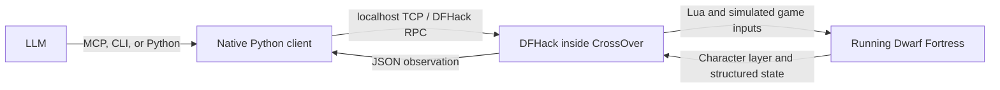

# DF-LLM: live adventure-mode harness

A working prototype for controlling the Windows Steam version of Dwarf Fortress
with DFHack from macOS/CrossOver. Python connects directly to DFHack over localhost;
there is no Wine subprocess per action and no screenshot/OCR dependency.

Tested on this Mac on 2026-09-06 with **DF 53.16 / DFHack 53.16-r1.1**, in the
CrossOver bottle `Steam`. The game is configured for **127.0.0.1:5001** because
macOS Control Center occupies port 5000.

## Use it now

Run these from this folder. Python 3 is the only host dependency.

```sh
./dfctl doctor
./dfctl observe --text
./dfctl status --text
./dfctl items --radius 20
./dfctl item 14438
./dfctl pickup 14434 --mode complete --acknowledge --text
./dfctl stow 14434 495 --mode complete --acknowledge --text
./dfctl walk-to 70 68 128 --mode complete --text
```

Item IDs and coordinates above are examples from this adventure; inspect the
current state before choosing targets. The controller chooses what to do and
when to interrupt. The harness executes the intervening game inputs and checks
the requested result.

Actions return **compact changes** by default: inventory, position, health,
visible creatures, encountered reports, and handled prompts. Use
`--result-format full` to include the complete observation, or call `observe`
separately. JSON is the default; `--text` produces a reading view.

The generic controls remain available. `move` takes one step;
`wait` sends `A_SHORT_WAIT`, one short game wait.
`wait-ready` waits for the game to finish an existing turn **without** taking a
game action. Every action returns a `dispatch` result after completion, a
controller decision, interruption, or an execution limit.

For menus and details:

```sh
./dfctl keys A_INV
./dfctl choose 'a unique visible label' --text
./dfctl click 98 15 --text
./dfctl inspect 75 73 128
./dfctl text 'some text'
./dfctl dismiss --text     # one detected help / More / Okay page
./dfctl key A_TALK --text
./dfctl select-unit 4232 --text  # only inside the conversation creature picker
./dfctl act '{"type":"move","direction":"nw"}'
./dfctl --log .df-llm/episode.jsonl observe
```

The coordinates above are examples from the first live test. Always use a fresh
observation for current coordinates and labels. Labels must match exactly one
place in the character layer. If a label appears twice (including repeated rows
for a tall tab), use `click X Y` for the intended occurrence.

## Comprehensive character status

Use `./dfctl status`, MCP `df_status` with `{}`, or `Client.status()` for the
current adventurer's comprehensive character report. `character-status`,
`df_character_status`, and `Client.character_status()` return the same report.
JSON is the default; `--text` adds a reading summary and preserves every
character section, including complete anatomy and item definitions.

**Compatibility change in MCP 0.5.0 / character schema 2:** `status` now returns
the character report with game/input state nested under `status`. For the old
lightweight readiness response, use `./dfctl game-status`, `df_game_status`, or
`Client.game_status()`. Routine observations and dispatch responses stay compact.

The character sheet contains:

| Section | Contents |
|---|---|
| Identity and affiliation | Name, age, sex/orientation, race/caste, professions, historical figure ID, civilization, groups, occupations, site links, squad, kill count |
| Health | Blood, pain, exhaustion, hunger/thirst/sleep counters, stun, unconsciousness, suffocation, fever, paralysis, vision/breathing and other explicit condition flags |
| Body | Named body-part IDs, active damage/treatment flags, functional limbs, raw size, wounds, syndromes and effect targets, all tissue layers, temperatures, and healing state |
| Attributes and skills | Stored/effective physical and mental attributes, attribute maxima, native skill records, ratings, effective levels, XP thresholds, and rust |
| Needs and personality | Physiological counters and exemptions, psychological needs, focus, stress, traits, values, goals, emotions, memories, preferences, habits, mannerisms and temporary changes |
| Equipment and movement | Full inventory and nested contents with body-part names, selected/current gaits and raw parameters, following target and native action types |
| Encumbrance | Total carried kilograms, weight by native inventory mode, ten heaviest carried items, cache validity, and displayed HUD speed when readable; unsupported capacity and load penalty are explicit |
| Conditions and appearance | All unit flag groups, mood, pregnancy/ghost state, curse and transformation modifiers, appearance modifiers/genes/colors/styles and their definitions |
| Relationships and companions | Named historical and unit links, social records and attitudes, recent conversation partners, companion and party membership |
| Knowledge and performance | Known books and performance forms, secrets, creature knowledge, rumors and witness reports, scholarly/religious knowledge, performance skills |
| Abilities and combat | Body and granted interactions, item powers and cooldowns, natural attacks, opponent/last hit, attack awareness, wrestling and kill records |
| Possessions, career and reputation | Item values, carried currency, debts/accounts, owned/traded items, familiarity, assigned buildings, career and reputation profiles |
| Obligations and activity | Journal agreements with typed details, religious objective, requests/commands, sleep permissions, current job, social activity, tagged action payloads, waiting/sleep and travel state |
| Senses and history | Valid detection slots, vision/smell state, character report logs and historical profiles, including artistic works and whereabouts |
| Coverage and native sheet | Availability and truncation by section; native description/thought/health prose when already populated for this character's open unit sheet |

The response has `format: "character_status"`, `schema_version: 2`, `available`,
the usual `state_id` / `effect_id`, current game/input `status`, and `character`.
When there is no active adventurer, it returns `available: false` with a reason.
`character.unavailable` identifies unreadable or unsupported fields, and
`character.truncated` records list limits. Missing data is distinct from zero,
false, or an empty list. Optional native profiles use `{present: false}` when
absent; an unreadable parent profile is unavailable instead. Equipment retains
its existing truncation flags and includes them in the report's coverage.

`character.coverage.sections` contains 29 sections, each marked `available`,
`partial`, or `unavailable`, with missing/truncated counts. Check this alongside
`unavailable` and `truncated` before assuming a field is known. `coverage.complete`
means no missing or truncated fields in the supported report, not that DFHack
exposes every internal game variable. Character-owned profiles are expanded;
world references use IDs instead of recursively copying other units or the world.
Native numeric enum fields have `enum_labels`; other raw numbers retain native
semantics. Historical profiles are kept under `history` and can differ from the
currently loaded unit. Their absence does not imply a healthy or empty character.

This is a read-only snapshot under DFHack's core suspension: it sends no game
input, opens no menu, and does not wait for a turn or dismiss prompts. Controller
dispatch/acknowledgement defaults do not turn it into an action. The detailed
reader is loaded only for this query, leaving routine observations compact.

Health and need counters retain native values; the harness does not invent
severity or urgency thresholds. Stored and effective attributes/skills are
separate. Body dimensions, wound counters and gait parameters retain native
units. Item masses also have a kilogram conversion as described below.
`health.recuperation_healing_rate` is the unit's native `effective_rate` field;
this field was previously misplaced under movement and is a healing rate.

Limits are 512 anatomical parts, 200 wounds with 512 parts per wound, 100
syndromes with 200 symptoms each, 300 skill records, 100 psychological needs,
values or goals, the last 100 native emotion records, and 100 native action
records. Additional profiles are bounded to 4096 entries per vector, 50,000
profile nodes, depth 10, and 16,000 bytes per string. The character inventory
allows 4096 total items and container depth 16; normal observations retain their
smaller limits. These are technical output bounds, with explicit truncation
metadata. The full report can be large; use `game-status` or `observe` for the
regular control loop and `status` for a complete character assessment.

Known current-build gaps are explicit: the native attack/dodge/charge-defense
preference globals. Appearance prose is unavailable
unless the matching unit sheet is already populated; structured appearance is
always attempted. The query does not open menus to manufacture these values or
substitute old formulas. Additional unsupported native variants also appear in
`unavailable`; untagged unions are never read. Quest/rumor/action payloads use
verified native type tags.

### Encumbrance, calculated movement, and physical needs

`character.encumbrance` is included in the same read-only status query:

| Field | Meaning |
|---|---|
| `total_weight_kg` | Physical mass of all carried equipment, containers, and contents; present only when `weight_complete` is true |
| `known_weight_kg` | Subtotal of valid cached weights, even when the full load is unknown |
| `by_mode` | Weight and item counts by native inventory role, with completeness for each group; `Worn` includes backpacks, and `Weapon` can include held clothing |
| `heaviest_items` | Up to ten carried root items, descending by kilograms, with IDs and descriptions; each container's weight includes its contents |
| `unweighed_items` | Items whose native weight cache is invalid or unreadable, with reasons |
| `capacity` | Native no-penalty capacity in kilograms, effective strength and body-size inputs, and calculation provenance; this is not a hard inventory limit |
| `burden` | Native HUD burden state and icon: `Unburdened`, `Burdened`, or `Overburdened`, with booleans, compared load, and exact thresholds |
| `load_penalty` | Skill-adjusted load, capacity used, excess kilograms, added movement cost, and speed reduction relative to the same state without load |

Mass is `weight_raw.whole + weight_raw.fraction / 1000000` kilograms, as defined
by [DF's mass structure](https://github.com/DFHack/df-structures/blob/master/df.d_basics.xml).
Valid native container weights already include their contents, and stack weights
already include the stack quantity. The sum counts each carried root ID once;
adding nested weights or multiplying by stack size would count them again.
The total is physical mass, without an assumed armor-skill discount.

All item observations and compact item changes include `weight_computed`.
Character inventory entries additionally include `weight_kg` only for valid
caches, or `weight_unavailable_reason` otherwise. An invalid cached value is
not zero. The reader does not call `calculateWeight` or mutate caches. The
aggregate reads native inventory independently of the detailed inventory's
output limits: at most 4096 entries, with at most 100 unweighed-item details.
If either bound is reached, truncation is explicit; an incomplete scan does
not produce a total.

`character.movement.displayed_speed` returns the current gait and numeric speed
from the game's ASCII character layer, e.g. `{gait: "Walk", value: 0.471,
text: "0.471", units: "native_display", source: "ui_character_layer"}`. The
reader requires the normal input-ready adventure view and an aligned gait/speed
pair at the bottom of the HUD, with a recognized native gait. Hidden or
unrecognized text produces an unavailable field; it never opens a menu or
uses a screenshot. This is the rounded displayed speed, not a capacity
percentage or a measurement of the penalty caused by weight alone.

`character.movement.effective_speed` is calculated from native state, independently
of the HUD or any open modal. It includes the current gait, buildup, native movement
cost/delay, unrounded rate, HUD-formatted value, the rate at full gait buildup,
and an unloaded comparison. Rates use the game's HUD units, not wall-clock
tiles/second; they do not guarantee movement is possible. The component list
explains contributions from load, health, needs, gait attributes, terrain, and
other supported modifiers.

`character.physiology.interpreted_needs` gives `hunger`, `thirst`, and `sleep`
warning labels, numbered native stages, raw counters, and the next stage's
threshold and remaining counter units. Creature exemptions are explicit; below
the first threshold the label is `No warning`. Blood thirst is included when
applicable. These are the game's warning stages, not controller threat decisions
or predicted wall-clock deadlines. Repeated labels retain distinct stage numbers.

These calculations are verified for the installed DF 53.16 Windows Steam
executable and gated by its version, OS, and PE timestamp. The implementation
reconstructs current native calculations in pure Lua; it does not call DFHack's
disabled `computeMovementSpeed` helper or reuse the obsolete encumbrance formula.
Other builds, mounted movement, unverified vision adjustments, missing/stale
inputs, arithmetic overflow, and bounded inventory scans return explicit
unavailability. See [calculation provenance, formulas, and limits](docs/character-calculations.md).

For the current adventurer: 98.46225 kg carried; 63.04 kg no-penalty capacity;
35.42 kg excess after native rounding; +1123 movement cost; **52.90% lower speed**
from load. Calculated Walk speed is 0.47103156 (HUD 0.471), versus 1.000 unloaded.
All three physiological timers are 9261, below their first warning thresholds.

The report now explicitly says **Overburdened**: the native HUD shows its light
burden icon above capacity and its heavy icon strictly above 150% of capacity,
using integer mass comparisons. For this character those thresholds are 63.04 kg
and 94.56 kg, respectively. A movement penalty and the heavy burden warning are
different thresholds. Missing load data produces an unavailable burden state.
This calculation works with the HUD hidden and applies no controller risk policy.

## Item and movement dispatches

`items` / `df_items` reads visible nearby ground items and nested container
contents in one query. `item` / `df_item` inspects one carried or visible ground
item. Both expose IDs, material, quality, wear, stack size, raw mass and volume,
container location, armor coverage/layer data, and weapon definitions where
applicable. Inventory observations expose the same item details.

| Action | Verified result |
|---|---|
| `pickup(item_id)` | The specified item is carried; approach its ground tile and navigate the pickup menu as needed |
| `equip(item_id)` | The item has native inventory role `Worn` |
| `wield(item_id)` | The item is held with native inventory role `Weapon` |
| `remove(item_id)` | The worn or contained item is held |
| `drop(item_id)` | The item is loose on visible ground |
| `stow(item_id, container_id)` | The item is inside the specified carried container |
| `walk_to(x, y, z)` | The adventurer reached the requested local tile |

`equip` and `wield` accept `replace: [ITEM_IDS]` and
`disposition: "hold" | "drop" | "stow"`. Stowing also requires `container_id`.
The workflow acquires the target, removes only the named replacements, equips
the target, then applies the requested disposition **after verifying the new
equipment**. `hold` is the default. The harness does not select better gear or
infer which existing items should be removed. An optional `body_part_id` adds
an exact postcondition; if the game chooses another body part, the result
returns for controller input rather than claiming success.

For example, after choosing replacement IDs from an observation:

```json
{
  "action": {
    "type": "equip", "item_id": 14429, "replace": [14438],
    "disposition": "stow", "container_id": 495, "body_part_id": 15
  },
  "execution": {"mode": "complete", "acknowledge": true}
}
```

The equivalent CLI is:

```sh
./dfctl equip 14429 --replace 14438 --disposition stow \
  --container-id 495 --body-part-id 15 --mode complete --acknowledge
```

Those IDs illustrate the live replacement test.
Menu options expose native item and container IDs, labels, visibility, and
option IDs. Semantic actions scroll and select the requested ID, even when
labels are identical. `select-option OPTION_ID` / `select_option` is available
for a controller-selected visible option. The binding is checked again inside
the game before input is sent.

Local walking uses the observed walkability map and replans after each verified
step. `allow_occupied` defaults to false, so walking avoids stepping onto units;
the controller can explicitly override it. `max_liquid_depth` defaults to 7
(no liquid-depth exclusion), and `blocked_tiles` defaults to an empty list.
These are route constraints, not a threat classifier. A blocked destination
returns its coordinates, exclusion reasons, and occupying creatures. Walking
is limited to the current z-level and the standard 41×21 observed crop; use
intermediate destinations for longer routes. Pickup uses the same local walker
with its default route constraints. For a custom approach, dispatch `walk_to`
first, then perform the item action from its tile.

Material or maker species does not prove fit. `fit.wearable_now` stays `unknown`
until an observed native Wear menu establishes current eligibility; the equip
result verifies actual wearing. Mass is returned as `weight_raw.whole/fraction`
with `weight_computed` indicating cache validity; character status adds kilogram
values and the aggregate described above. A held garment also has role `Weapon`, so
use the separate item `type` and weapon definition to distinguish weapons.

## Controller-selected execution

The controller chooses execution policy for each dispatch or sets defaults once.
The same policy applies to item workflows, walking, waits, keys, clicks,
conversations, and menu actions. The harness does not classify their risk. This separation is documented
in [AGENTS.md](AGENTS.md) and implemented in [dispatch.py](dfharness/dispatch.py).

| Setting | Behavior | Default |
|---|---|---|
| `mode: "step"` | Execute one mechanical step plus delegated acknowledgements; return remaining work as `in_progress` | `step` |
| `mode: "complete"` | Execute the whole requested workflow, including Finish when a Continue/Stop/Finish prompt appears | — |
| `acknowledge: true` | Handle detected help and announcement pages, including More/Okay, and retain their text | `false` |
| `max_steps` | Limit actual game inputs, including menu navigation and automatic responses; registering/resuming a dispatch consumes no input | `32`, range 1–64 |
| `interrupt_on` | Stop on controller-selected facts, checked before further inputs | `{}` |

Completion and acknowledgement are independent settings. A response that has not
been delegated returns `needs_input`. Unknown detected prompts also return to the
controller. Complete mode follows the submitted action and its explicit targets.

```sh
./dfctl key A_TALK --acknowledge --text
./dfctl resume --mode complete --acknowledge --text
./dfctl resume DISPATCH_ID --mode complete --acknowledge --text
./dfctl interrupt DISPATCH_ID
./dfctl respond continue --text
./dfctl respond stop --text

# Defaults before the command; overrides after an action command.
./dfctl --acknowledge mcp
./dfctl --acknowledge key A_TALK --no-acknowledge --text
```

Use the returned `dispatch.resume_action` to continue a saved workflow after a
step, interruption, limit, or controller decision. It identifies the previous
dispatch and creates a new dispatch ID; completed inputs are not repeated.
Always resume the latest continuation. A resume without an ID only settles the
current native action/prompts; it does not recover an item or walking recipe.
Each dispatch, including resume, uses controller defaults plus that call's
overrides. Put persistent interruption rules in controller configuration.
`observe`, `status`, `items`, and `wait-ready` remain read-only.

`interrupt_on` supports `blood_loss`, `new_wounds`, and `new_visible_units`
booleans, plus `visible_unit_ids` and exact native `report_types` lists.
Health and newly visible creatures are compared with the dispatch's initial
observation. Reports already returned by a prior dispatch remain in history
but do not trigger the same interruption again after resume. These are factual
predicates: a newly visible creature is not automatically classified as hostile.

```sh
./dfctl --mode complete --acknowledge \
  --interrupt-on '{"blood_loss":true,"new_wounds":true}' mcp
```

`df_interrupt` / `interrupt` stops future harness inputs and preserves progress.
The MCP server accepts status/observation and interruption requests while
`df_act` is running; MCP cancellation also requests interruption. An input
already submitted to the game is not undone or cancelled. Stopping a native
long action still requires the controller's explicit game response. No core
lock is held while waiting for the game or controller.

Read `dispatch.outcome` alongside the returned game state:

| Outcome | Meaning |
|---|---|
| `completed` | Semantic postconditions are verified; primitive inputs have settled at an input boundary |
| `in_progress` | Step mode returned with more mechanical work to perform |
| `needs_input` | A choice, unavailable item action, blocked route, or unsupported completion needs controller input |
| `interrupted` | The controller interrupted explicitly or one of its factual predicates matched |
| `no_effect` | Input produced no observable change, or a delegated response left the same prompt |
| `limit_reached` | The step budget or dispatch timeout was reached |
| `failed` | The game input handler reported an error; partial effects are possible |

Semantic actions verify inventory roles, exact item/container IDs, or position.
A completed generic key/click does not prove an arbitrary objective such as
successfully greeting someone. Read its resulting menu and reports.
RPC/validation failures are tool errors and are never retried automatically.
Dispatch errors include the dispatch ID and a recovery action; if registration
failed, that checkpoint may not exist. Observe/status before continuing.

Each result includes `dispatch.steps`, observed reports in `dispatch.events`,
and handled prompt text/responses in `dispatch.prompts`. Resumes retain event
and prompt history. Compact results store each distinct handled prompt once;
`prompt_sequence` gives the zero-based prompt indices in encounter order. Full
results and the JSONL log retain the uncompressed observations/history.
Each observation reads only the latest 80 reports, so very long game actions can
produce more messages than this captures. Use the JSONL log to retain observations
across calls.

The dispatch timeout defaults to 30 seconds, with a maximum of 300 (`--seconds`
on CLI actions, `timeout` in Python/MCP). It is checked between RPC calls; a call
in progress has its own transport timeout, and returning does not cancel an
ongoing game action. An unchanged prompt stops automation instead of sending
repeated continues. The Continue/Stop/Finish input mapping is implemented but
remains **unverified live**; investigation is deferred until it appears again.

## Connect an LLM

Run `./dfctl mcp` as an MCP stdio server. It exposes eleven tools:

| Tool | Purpose |
|---|---|
| `df_observe` | UI text, ASCII map, health/inventory, creatures, conversation labels, recent reports |
| `df_act` | Dispatch an action or resume it with controller-selected completion and acknowledgement policy |
| `df_items` | Query nearby visible items and container contents in one call |
| `df_item` | Inspect one carried or visible ground item by ID |
| `df_interrupt` | Stop further inputs from an executing dispatch and preserve its progress |
| `df_inspect` | Terrain, liquid depth, ground items, and creatures at a world tile |
| `df_status` | Comprehensive read-only character report, section coverage, and current game/input status |
| `df_character_status` | Alias for the comprehensive character report |
| `df_game_status` | Lightweight mode, focus, panels/modal, position, active dispatch, and turn readiness |
| `df_keys` | Discover interface keys from this running DF version |
| `df_wait_ready` | Wait for an already submitted turn/action to settle |

[mcp.example.json](mcp.example.json) contains the configuration for this Mac, for
clients that use the `mcpServers` JSON format. Other clients need the same command
and arguments entered in their MCP settings. This file has **not** been installed
into any LLM application's settings. The example enables acknowledgements as a
controller default; completion mode remains selectable per dispatch. No API key
or model provider is required by the harness itself.

Example `df_act` arguments to delegate the remaining steps of the current action:

```json
{
  "action": {"type": "resume"},
  "execution": {"mode": "complete", "acknowledge": true, "max_steps": 32}
}
```

Recommended instructions for the controlling model:

> Start with df_observe. Choose objectives, equipment, replacements, and threat
> policy from structured state. Use df_items/df_item to compare equipment, then
> dispatch pickup/equip/wield/drop/stow or walk_to with explicit targets. Choose
> execution.mode and acknowledge to delegate execution mechanics; use interrupt_on
> for your chosen factual interruption conditions. Read outcome, changes, events,
> and blockers. Use one active dispatch at a time; df_interrupt can stop it while
> it runs. Continue with dispatch.resume_action when appropriate. Pass the latest
> state_id as expect. For unsupported actions, use df_keys and generic controls.
> After a timeout or lost reply, observe before explicitly resuming; never blindly
> repeat the original action.

Use `df_status` when character condition, skills, needs, equipment, relationships,
abilities, or obligations are needed to inform those decisions. Use
`df_game_status` for lightweight readiness checks.

Read `status.modal` before acting. `{"type":"dismiss"}` acknowledges **one** help
or announcement page; with `acknowledge: true`, the dispatch also handles subsequent
pages. For incremental control, leave acknowledgement disabled and inspect each
page. `{"type":"action_prompt","choice":"continue"}` sends an explicit response;
`stop` and `finish` are also accepted choices, subject to the live-validation
limitation above.

For conversations, open `A_TALK` with acknowledgement enabled, then use
`{"type":"select_unit","unit_id":ID}` with a visible creature from the map.
This action is restricted to the conversation picker and rejects targets outside
the viewport or covered by detected UI text. It performs a normal game click.
Inspect `conversation.options` for the full target label/participant IDs, select
the displayed option, and use `click_text` for a visible topic such as
`Greet listener` or `Ask how listener is feeling`. Speaking advances game time
and normally closes the menu; reopen it to continue.

`conversation.choices` includes untruncated topic labels, including topics that
may require scrolling or filtering before clicking. Its indices are zero-based
list indices, not guaranteed keyboard shortcuts. `reports` contains the last 80
game reports with stable IDs, speaker IDs, and conversation/activity IDs. Match
both IDs to distinguish a reply from nearby chatter; persist the JSONL log for
longer sessions. [CONVERSATIONS.md](CONVERSATIONS.md) records the live test.

The Python interface uses the same operations:

```python
from dfharness.client import Client

game = Client(log_path=".df-llm/episode.jsonl", execution={
    "mode": "complete", "acknowledge": True,
    "interrupt_on": {"blood_loss": True, "new_wounds": True},
})
view = game.observe(width=41, height=21)
if view["status"]["can_move"]:
    result = game.act(
        {"type": "move", "direction": "w"},
        expect=view["state_id"],
        request_id="one-unique-id-per-intended-action",
    )
```

## How the harness works



- **Observation:** the Premium UI character layer plus a bounded semantic ASCII
  map centered on the adventurer. Tile visibility and creature hiding use DFHack
  APIs. Equipment includes bag contents, food, drink containers, and their contents.
  Health values are raw game counters, not invented percentages or diagnoses.
- **Input:** `gui.simulateInput()` uses the game's named interface keys and mouse
  inputs. The harness does not teleport units, spawn items, or modify character
  stats. `A_STATUS` opened the character sheet in the tested build; `A_INV_LOOK`
  did not open it from the main adventure view, illustrating why the returned
  state must be checked.
- **Synchronization:** each request runs with DFHack's normal core suspension.
  Actions schedule a callback after two raw frames, then the Python client polls
  until the callback has run and adventure mode is taking input again. Active
  waits, sleep, long actions, and site offloading also affect readiness. Prompts
  that need a response count as input boundaries. The suspension is released
  between requests so the game can make progress.
- **Dispatch:** one shared Python driver applies the controller's policy after
  every input. Recipes use ordinary game keys/clicks and verify item IDs, roles,
  container membership, and positions. One active-dispatch lease serializes
  inputs across clients. Workflow progress is checkpointed in DFHack before
  input, so an explicit resume can verify an input whose reply was lost.
  Each automatic input uses the latest `state_id`; events and prompts are retained.
- **Guards:** movement requires the default local adventure view, input readiness,
  no known open adventure panels, and no detected blocking prompt. An optional `expect` token checks focus,
  UI text/dimensions, viewport origin/zoom, player position, time, and the harness action serial inside
  the same suspended request that sends input.
- **Retries:** an explicit `request_id` deduplicates within the last 128 root
  dispatches in the running game session. Individual input receipts have a
  separate 128-entry buffer; automatic responses do not evict root dispatch IDs.
  Reusing an ID with different arguments, including execution policy, fails.
  A duplicate returns the recorded dispatch result with a fresh observation and
  `dispatch_replayed: true`; it sends no additional inputs. If the earlier
  dispatch was interrupted before recording its result, it reports that state
  and requires an explicit resume by dispatch ID to continue. Checkpoints survive
  client restarts, but are lost on game restart or buffer eviction. Resume checks
  save/adventurer identity; local item/route recipes must be reassessed after
  travel changes the local coordinate system. Replaying a duplicate returns a
  cached outcome alongside fresh state, not a newly verified completion.
  There are no automatic action retries. Input errors can have partial effects,
  so errors direct the caller to inspect the game.
- **Logging:** `--log PATH` / `Client(log_path=...)` records requests, structured
  responses, timestamps, and latency as JSONL. Readiness polling is omitted.

There are two distinct coordinate systems. `Uyy|` uses **UI character cells**:
the zero-based character position after `|` is x. `Myy|` uses **map crop cells**:
add the crop origin to column/row for the local world tile. A map cell cannot be
passed directly to the UI click action. Local world coordinates can change when
adventure mode loads a different area; observe again after travel.

## Your original script

`./df-ascii` remains available, also as `./dfctl native-ascii`. Its original Lua
capture is preserved: it temporarily performs a native classic render, copies
the glyphs, and restores the graphics buffers. The only adapter change is finding
the new adjacent native `dfhack-run` client. The original CP437 mapping is also
reused by the structured bridge.

That capture successfully ran on the installed version, including its buffer
restoration checks. Keep it as an **experimental exact-glyph view**: its raw
buffer layout assumptions and renderer synchronization are version-dependent.
The default structured observer uses public DFHack readers and its own explicit
terrain legend, so it does not need the temporary rendering-mode change.

For an explicit developer escape hatch, `./dfhack-run COMMAND ARG...` and
`./dfctl run COMMAND ARG...` invoke DFHack directly. Arbitrary commands/Lua are
not exposed by the MCP tools.

## Starting the game later

DFHack must be loaded in the running game. The connection does not depend on the
game window being foregrounded.

```sh
./dfctl setup --port 5001   # already done on this installation
./dfctl launch            # request DFHack via Steam in CrossOver
./dfctl game-status
```

Steam's DFHack launcher installs its hook. If Steam does not then start the game,
`./dfctl launch --direct` starts the DF executable using that installed hook.
Avoid launching another instance when the game is already running.

`setup` writes `dfhack-config/remote-server.json` with `allow_remote: false`,
preserves unrelated settings, and keeps a backup of a pre-existing file before
changing it. Restart the game after changing its port. The client always connects
to loopback. Port selection is `--port`, then `DFHACK_PORT`, then the discovered
game config, then 5000.

Discovery covers standard CrossOver Steam bottles and common native Steam paths.
For a custom library, set `DF_PATH` to the game installation directory. If multiple
installations are found, this setting selects one. In the tested Windows build,
saves live under the bottle's
`drive_c/users/crossover/AppData/Roaming/Bay 12 Games/Dwarf Fortress/save`.

## Development

The development environment is pinned to Python 3.12 and managed by
[uv](https://docs.astral.sh/uv/). Create or refresh it from the committed lockfile:

```sh
uv sync --locked
```

Install [Luacheck](https://github.com/lunarmodules/luacheck) and
[ShellCheck](https://www.shellcheck.net/) with your system package manager, then run
the same checks as CI:

```sh
make check
```

`make lint-fix` applies safe Ruff fixes and `make format` formats Python sources;
`ty` provides a lightweight static type check. Vulture deliberately scans only
the production package and executable shims—not `tests/`—so a definition
referenced only by a test is still reported as dead code. Lua is checked against
Lua 5.3 syntax with DFHack's injected globals declared in `.luacheckrc`.

## Validation and current limits

`python3 -m unittest discover -s tests -v` runs 74 offline tests covering fragmented
TCP replies, protocol failures, Unicode, malformed packets, action readiness,
MCP lifecycle/argument validation, policy defaults and overrides, delegated prompt
chains, unchanged prompts, execution limits, event retention, readiness races,
resumption, and duplicate requests without additional game input. Workflow tests
cover identical item labels, automatic scrolling, equipment replacement order,
container selection, failed postconditions, compact results, caller-selected
interruptions, lost replies, and concurrent MCP interruption/cancellation.

Character-query tests cover read-only CLI/client/MCP routing, argument rejection,
missing-adventurer results, and readable output preserving impairments,
encumbrance, zero/partial weights, and unavailable fields.
`python3 -m tests.live_character_status --port 5001` additionally
checks the CLI, MCP, and Python query against the running adventurer and verifies
unchanged game time, input serial, health, and inventory. It runs 47 isolated
Lua fixtures for wound/anatomy mapping, syndrome effects, false/zero values,
effective stats, truncation, missing soul/body data, container/stack accounting,
cache validity, inventory limits, and HUD speed recognition. Profile fixtures cover
absent versus unreadable records, tagged unions, pointer boundaries, body/granted
abilities, creature exemptions, unused detection slots, active action payloads,
stale sheet text, and coverage of bounded output. Calculation fixtures cover
all need stage boundaries, exemptions, load quantization, armor discounts,
large-body arithmetic, current gait/buildup, health and terrain modifiers,
clamping, exact burden-icon boundaries, unavailable inputs, build guards, and operation without any UI data.
Live validation also compares calculated speed with the native ASCII HUD. These fixtures do not
insert or injure units in the game.

Live validation on the user's adventure verified:

- Direct macOS ↔ Windows DFHack RPC and title/menu text extraction.
- Adventurer position, health, equipment, nested containers, visible units, and
  tile inspection.
- Comprehensive character status on the current human adventurer: 89 body
  parts, six physical and 13 mental attributes, eight skill records, 22 needs,
  personality/goals, equipment and gaits, with game state unchanged by querying.
- Expanded schema 2 status: 29 sections, 249 tissue layers, 64 social records,
  a named capybara companion, Pet animal/Spit abilities, known works and creature
  knowledge, and the Offer Service agreement with the Order of Luck. All character
  query aliases return identical data. The two documented unavailable fields are
  explicit; this character's report has no truncated lists.
- A short wait, one step west, and a step back east to `(76, 73, 128)`.
- Opening the character sheet, clicking its Items tab, and closing it.
- Rejecting movement in a menu and input based on an old observation.
- Deduplicating an action without sending the key a second time.
- The supplied native ASCII capture and continued game responsiveness.
- MCP initialization, tool discovery, live observation, opening the character
  sheet through `df_act`, and returning to normal gameplay through `df_act`.
- Eleven conversations, each with a greeting, feelings question, and troubles
  question; 33 direct replies matched to their speakers/conversations.
- Selecting conversation targets by unit ID, extracting untruncated menus,
  dismissing help and multi-page announcements, and blocking movement in a prompt.
- Opening Talk and acknowledging its help page in one CLI dispatch, then replaying
  the same request without additional inputs.
- Overriding the MCP acknowledgement default to return at the help page, then
  resuming with completion and inherited acknowledgement enabled. These menu
  checks left position, health, and game time unchanged and returned to gameplay.
- Looting room containers through the pickup menu, scrolling item lists, replacing
  seven equipped items, and verifying the resulting inventory roles and IDs.
  The original run used generic controls and informed the semantic workflows.
- Dropping an item incrementally, resuming by dispatch ID, then acquiring it by
  ID with automatic menu scrolling and verified backpack membership.
- A complete equipment replacement: 15 game inputs to pick up a boot, remove the
  old boot, wear the target, and stow the old one; 11 inputs in a second dispatch
  restored the original boot and dropped the test replacement.
- Holding an item with `wield` and stowing it into a specified backpack with
  `stow`; help text was extracted from native state without screenshots.
- Interrupting a live walking dispatch after its first input through MCP while
  concurrent status still responded, then resuming to the specified tile.
- A caller-specified visible-unit condition stopping a dispatch before any input,
  a route returning at an occupied target, and a controller occupancy override
  completing the return. Position `(70,68,128)`, equipment, and backpack contents
  were restored; wounds remain zero. These tests advanced game time.

This is an adventure-first control foundation. Combat, eating,
travel, and character creation currently use the generic key/click tools; they
do not yet have validated high-level action wrappers. The character layer can
include duplicate or residual text and omit icon-only controls. DFHack focus
strings do not describe every possible prompt. Check the resulting game state
instead of treating text/focus alone as a complete UI model. The specific
Continue/Stop/Finish response remains unverified live; see
[DEVELOPMENT.md](DEVELOPMENT.md). Conversation target selection and basic topics
are verified; deeper dialogue branches and arbitrary modal handling are not.

The semantic map is a single z-level terrain summary, with creatures and building
occupancy. It does not reproduce all native glyphs, colors, items, or overlays.
The visibility checks are useful for play, but are not a strict anti-cheating
information boundary. The next useful increment is typed menu actions with
verified postconditions, especially consume, converse, and attack.

Nearby item queries default to radius 20 (maximum 50), a depth of four nested
containers, and a 500-item budget; inventory has a 300-item budget. Truncation is
reported. Native walkability comes from DF's cached groups and may be stale;
movement still verifies arrival after each step. Inventory fit/capacity conflicts,
quantity pickers, and unrecognised choices return `needs_input`. Equipment
replacement is resumable but does not automatically roll back a partial change.
Interrupt predicates use observed state and the latest 80 reports per poll;
they cannot guarantee capture of every event during a very long native action.

Protocol/API references: [DFHack remote interface](https://docs.dfhack.org/en/stable/docs/dev/Remote.html),
[DFHack Lua API](https://docs.dfhack.org/en/stable/docs/dev/Lua%20API.html),
[MCP stdio transport](https://modelcontextprotocol.io/specification/2025-11-25/basic/transports).
