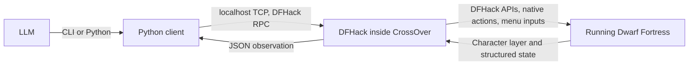

# Development and setup

Read [AGENTS.md](../AGENTS.md) for the design rules and legacy adapters. Use
the [agent guide](../dfharness/guide.md) for routine play.

## Connection and launch

DFHack must be loaded in the running game; the window need not be foregrounded.

```sh
./dfctl setup --port 5001   # once per installation
./dfctl launch              # ask Steam in CrossOver to start DFHack
./dfctl game-status
```

If Steam installs the hook but does not start the game, `./dfctl launch --direct`
starts the executable with the installed hook. Do not launch a second instance.

`setup` writes `dfhack-config/remote-server.json` with `allow_remote: false`,
preserves unrelated settings and backs up a pre-existing file. Restart the game
after changing the port. The client always connects to loopback. Port selection
is `--port`, then `DFHACK_PORT`, then the discovered game config, then 5000.
Discovery covers CrossOver Steam bottles and common native Steam paths; set
`DF_PATH` for a custom library. In the tested Windows build, saves live under
the bottle's `drive_c/users/crossover/AppData/Roaming/Bay 12 Games/Dwarf Fortress/save`.

## Environment and checks

The environment is pinned to Python 3.12 and managed by
[uv](https://docs.astral.sh/uv/):

```sh
uv sync --locked
make check
```

`make check` needs [Luacheck](https://github.com/lunarmodules/luacheck) and
[ShellCheck](https://www.shellcheck.net/). `make lint-fix` applies safe Ruff
fixes and `make format` formats Python. Vulture scans only the production
package and the executable shims, so a definition referenced only by a test is
reported as dead. Lua is checked as 5.3 with DFHack's globals from `.luacheckrc`.
Test suites are described in [tests and known limits](validation.md).

Pinned read-only clones of dfhack, df-structures and scripts for 53.16-r1.1
live under `.df-llm/upstream/`; see its README. Known gaps in that release:
`computeMovementSpeed` is a stub, the installed `quicksave` is fortress-only
and `load-save` uses obsolete title fields. The repository supplies its own
burden helper, an adventure quicksave extension and a repaired loader. Do not
work around gaps with binary-specific models.

`./dfctl audit-log PATH...` summarizes RPC and receipt sizes from JSONL logs
without connecting to the game. Measurement settings are described in
[measurement](measurement.md).

## Architecture



- **Observation.** The Premium UI character layer plus a bounded semantic ASCII
  map centered on the adventurer. Visibility and creature hiding use DFHack
  APIs. Health values are raw game counters.
- **Input.** Actions use DFHack APIs and native action structures where they
  exist, then menu adapters through `gui.simulateInput()` with named interface
  keys and mouse input. The harness never teleports units, spawns items or edits
  character state.
- **Synchronization.** Each request runs under DFHack's core suspension. An
  action schedules a callback after two frames, and the client polls until it
  has run and adventure mode is taking input again. Waits, sleep, long actions
  and site offloading affect readiness. The suspension is released between
  requests.
- **Dispatch.** One shared Python driver applies the controller's policy after
  every input. Recipes verify item IDs, roles, container membership and
  positions. One active-dispatch lease serializes inputs across clients.
  Workflow progress is checkpointed in the DFHack session before each input so
  a lost reply can be verified on resume.
- **Guards.** Movement requires the default local view, input readiness, no
  open panels and no blocking prompt. The `n2:` state token covers native
  context, option identities and order, targets, filters, prompts, scroll,
  character health and inventory, visible units, report cursor, position,
  coordinate frame, time and action serial. Full observations also expose
  `ui_state_id` (`u2:`) for raw UI inputs. Guards run inside the request that
  sends input.
- **Retries.** An explicit `request_id` deduplicates within the last 128 root
  dispatches; reusing it with different arguments fails. A duplicate returns the
  recorded result with a fresh observation and sends nothing. Uncertain delivery
  is never retried. Input errors can have partial effects, so errors direct the
  caller to observe.
- **Logging.** `--log PATH` or `Client(log_path=...)` records requests,
  responses, timestamps and latency as JSONL, including processing polls.

Two coordinate systems exist. `Uyy|` rows are UI character cells, with x as the
zero-based offset after the bar. `Myy|` rows are map crop cells; add the crop
origin for the local world tile. Map cells are not click coordinates. Local
coordinates change when a different area loads; observe again after travel.

## Raw UI operations

Raw operations are development tools, not controller actions:

```sh
./dfctl keys A_INV
./dfctl choose 'a unique visible label' --text
./dfctl click 98 15 --text
./dfctl text 'some text'
./dfctl key A_TALK --text
./dfctl select-unit 4232 --text   # only inside the conversation creature picker
./dfctl run COMMAND ARG...        # any DFHack console command
./dfhack-run COMMAND ARG...
```

Always use a fresh observation for coordinates and labels. A label must match
exactly one place in the character layer; if it repeats, click the intended
occurrence by coordinates.

## History and evidence

[history.md](history.md) lists what shipped and where each change's evidence
lives. Local traces, measurements and the longer review write-ups are kept
under `.df-llm/`, which is not tracked.
